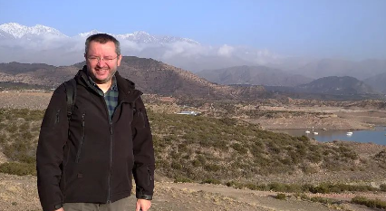

# Sobre mi

Soy bioquímico, con una maestría y doctorado en biología molecular vegetal, y con un posgrado en robótica e inteligencia artificial. Me desempeño como docente en la Universidad de la República,  actualmente integro proyectos de investigación que combinan en fenotipado vegetal con el desarrollo de equipamiento científico en modalidad open hardware. En los últimos años junto a otros colegas hemos estado instalando y desarrollando un espacio de prototipado asociado a estos proyectos y abierto a recibir estudiantes y colegas. 
A lo largo de este posgrado espero poder aprender de los docentes y compañeros sobre las temáticas que el mismo abordará. 

**[my website](https://community.emergentfutures.io/courses/5566525/content)**
