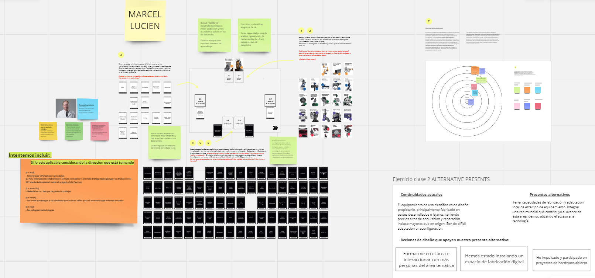
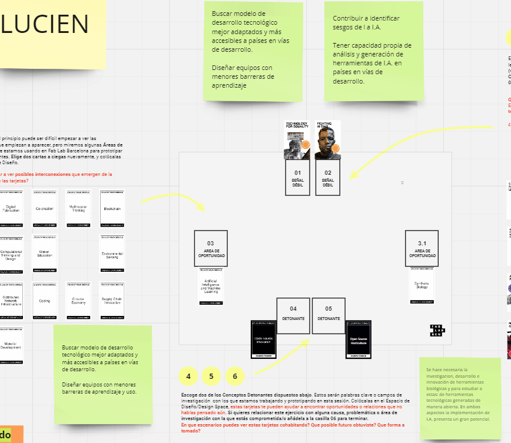
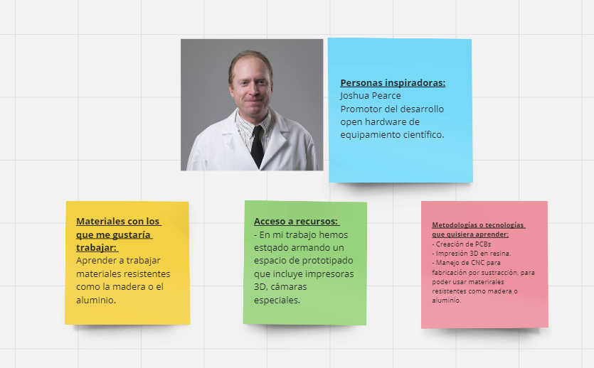
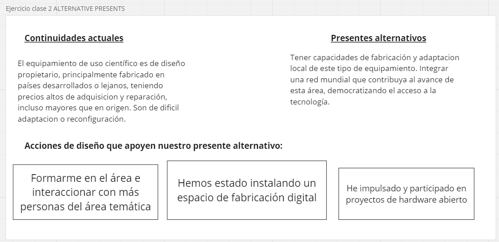
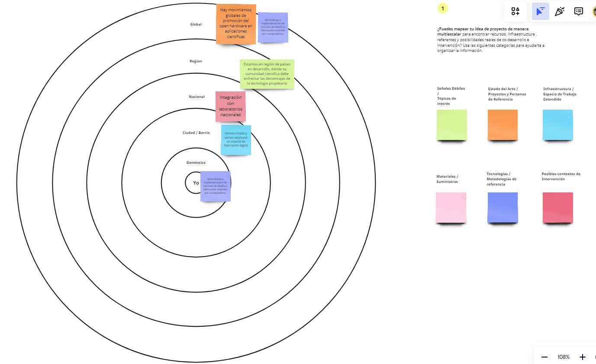

---
hide:
    - toc
---

# MD01

Durante este módulo, a lo largo de 3 clases y con el trabajo domiciliario, se experimentó un abordaje para insipirarse e identificar áreas de interés en las que crear un proyecto. O bien, si ya se tenia un proyecto en un área relativametne definida, analizarlo y abordarlo desde diferentes ángulos que fueron generados a lo largo de la dinámica de las actividades propuestas en este módulo. 

En la figura 1, se muestra el tablero creado con la herramienta Miro, representando el espacio de diseño que desarrollé durante las tres clases. A este tablero puede accederse a través de este enlace: https://miro.com/app/board/uXjVKQD5ciI=/

 Figura 1. Imagen general del espacio de diseño generado con la herramienta Miro. 

El primer día de trabajo elegí dos señales débiles del reperotorio de opciones que estaban disponibles, y redacté párrafos de su vinculaicón con mi área de interés (Figura 2). Tambien elegí las cartas de áreas de oportunidad y de detonantes, redactando tambien como me parcećia que estaban vinculadas con mi área de interés (Figura 2). 

Figura 2. Detalle de las áresa de interés elegidas, junto a las cartas de áras de oportunidad y detonantes elegidos. 

Tambien el primer día, hice los componentes opcionales: agregando una personas inspiradora del área, materiales con los que me gustaría trabajar, forma de acceso a los recursos y metodologías o tecnologías que me gustaría aprender (Figura 3). 

Figura 3. Elementos opcionales que elegí para complementar la actividad del primer día de trabajo. 

El segundo día de trabajo se trabajó sobre la descripción del presente actual en el ára de trabajo que elegí, y sobre la del presente alternativo que desearia concretar. A la vez que tambien indiqué tres líneas de trabajo para lograr esa concreción (Figura 4). 

Figura 4. Esquema de los situación actual presente y alternativa que quisera se concretara en mi área de interés. 

Por último, en el tercer día de trabajo se consideraron diferentes aspectos vinculadoas a mi área de interés, en diferentes escalas (Figura 5).

Figura 5. Escalabilidad de diversos aspectos vinculados a mi área de interés. 

Una reflexion final sobre los tres ejercicios hechos, es que estos son importantes herramientas para poder identificar un área de interés sobre la que trabajar, o alternativamente: frente a una idea previamente concebida de un proyecot, poder cuestionarlo o analizarlo desde diferentes angulos, y con diferentes criterios. 

--------------------------------------------------------------------------------------
Ejercicio opcional: Proponer una idea para el ejercicio first person perspective. 
--------------------------------------------------------------------------------------

Para este ejercicio planteo el caso que quisiera diseñar un incubador de placas de Petri. Luego de decidido que el mismo debe contar con un termostato para poder operar a temperatura controlada por el usuario, un mecanismo de calefacción y de refrigeración para controlar la temperatura. Tambien deberá contar con un mecanismo de agitación de las placas, regulable por el usuario. 
En una primera instancia podria diseñar una maqueta del equipo, con el tamaño previsto, con la disposicion de los elementos que cra más conveniente, pero no funciona. Sobre esta maqueta, simulando que es funcional, probaría el uso del dispositivo. Buscando ver si los pasos de operacion previstos, son logicos y faciles de hacer. Analizando si la disposicin de los elementos estructurales y de operacion de han elegido colocar en una adecuada posisicion. Tambine podria simular los mensajes o información en pantalla que mostarai el equipo, para poderlos ajustar a la mejor funcionalidad que encuentre al experimentar en primera persona el manejo del equipo. 
Seria imporante que ademas de mi experiencia personal, contara con la de otras personas que tambien fungiendo como usuarios, evaluasen la estructura y operabilidad del equipo. 
Una vez que tenga un prototipo funcional del agitador de placas, reiteraría esta experiencia desde la perspectiva de primera persona, para ajustar en cas de ser necesario, su diseño. 

