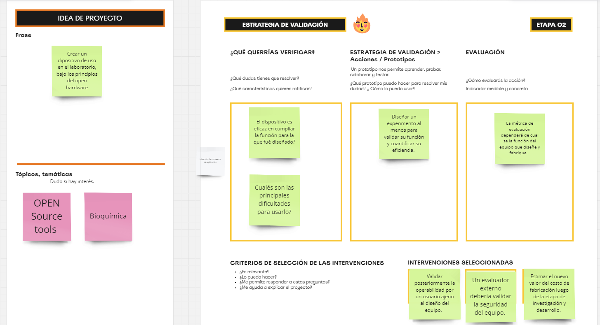

---
hide:
    - toc
---

# MD02

Durante las clases de este modulo se continuó el camino para definir el proyecto. Para lo cual se hicieron dos ejercicios. Los resultados de ambos ejercicios se muestran en las figuras 1 y 2, los del primer ejercicio, y en la figura 3 los del segundo ejercicio. respectívamente. 
Al taablero usado puede accederse a través de este enlace: https://miro.com/app/board/uXjVK9Q-_oY=/

 Figura 1. Primer resultado del primer ejercicio.  

 Figura 2. Segundo resultado del primer ejercicio. 

 Figura 3. Resultado del segundo ejercicio. 
