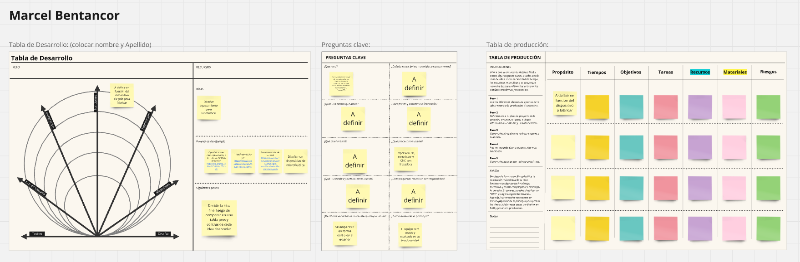
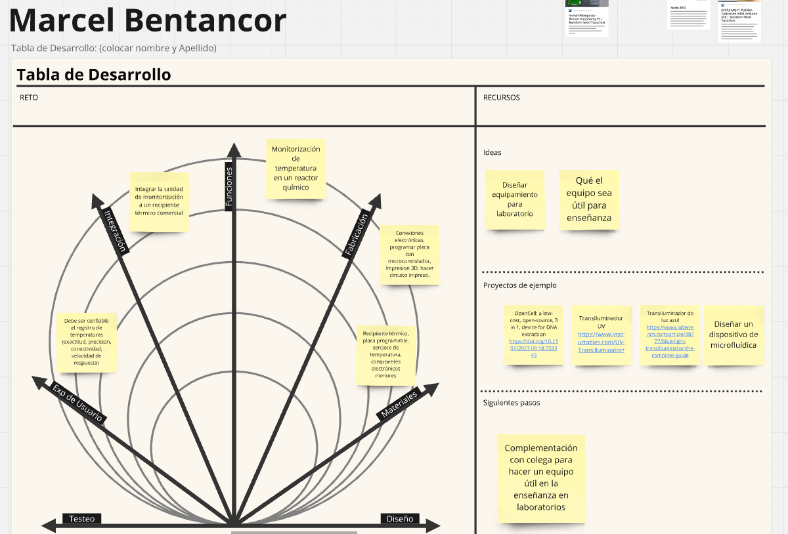
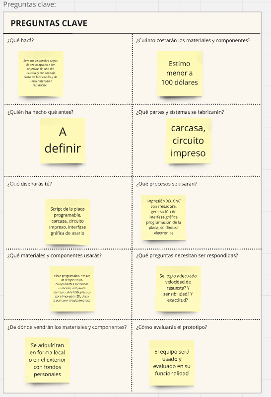
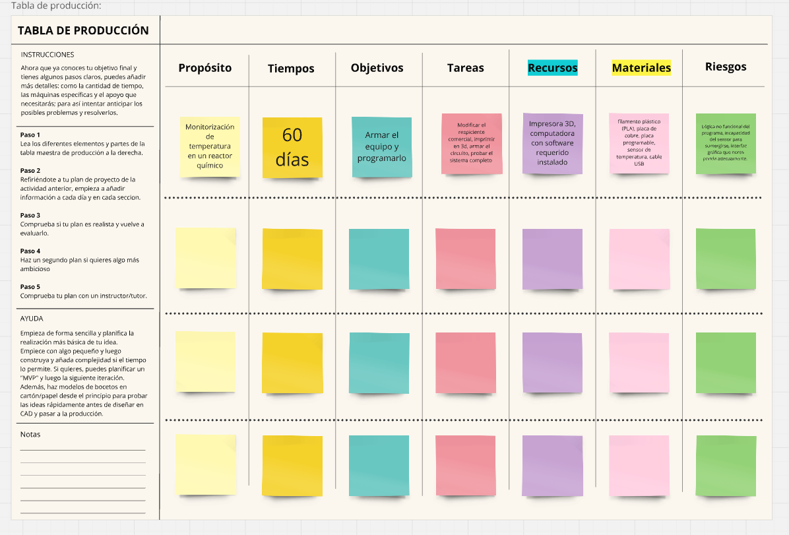

---
hide:
    - toc
---

# MD03

En este módulo se trató de seguir definiendo el proyecto final y esbozando las etapas para concretarlo. En mi caso aún no he decidido el proyecto concreto, y manejo varias posibilidades. En las siguientes semanas espero definirlo más especificamente y asi completar los puntos que restan completar en el esquema efectuado en este módulo (Figura 1). 

**Figura 1**, esquema de los elementos de decision para definir el proyecto final. 

**Actualización:** 
Trás un período de consideración de varias alternativas y trás haber conversado con colega en mi trabajo, opté por colaborar con él haciendo la automatizacion de un dispositivo de termoquímica, logrando de monitorizar la temperatura en el interior de un reactor químico. 
El tablero actualizaod se muestra en las siguietnes figuras (2-4). 

**Figura 2**, tabla de desarrollo del proyecto final. 

**Figura 3**, esquema de preguntas clave para proyecto final. 

**Figura 4**, tabla de producción para el proyecto final. 

