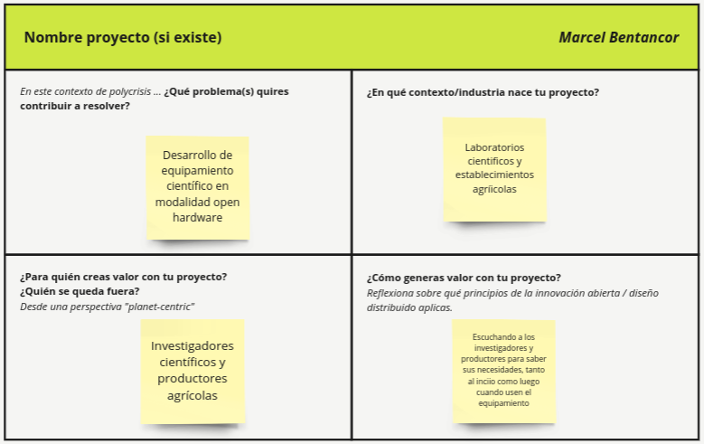
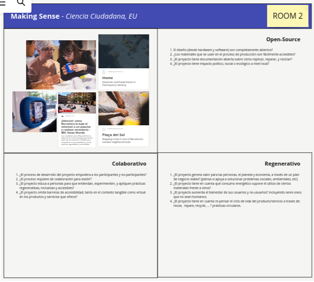

---
hide:
    - toc
---

# MI01

En este primer módulo de innovación se desarrollaron dos actividades a lo largo de dos clases. 

**Actividad 1**
En la primera de ellas se debieron contestar 4 preguntas sobre el proyecto (sí existiese) o él área general donde se quiera hacer el proyecto final, ver figura 1. 

En las dos primeras preguntas, respondí que me interesa el desarrollo de equipamietno científico bajo modalidad open hardware, para su uso en laboratorios científicos o en establecimientos agrícolas. 

Luego consideré que los princiaples actores tenidos en cuenta son los científicos o productores agrícolas para cuyas necesidades se diseñarían los equipos. Este proyecto generaría valor no sólo atendiendo las necesidades de los cientficos o productores al hacerl diseño inicial de los dispositivos, sino que tambien desaría que exista retroalimentación por parte de ellos mientras estén usando los equipos diseñados. 

**Figura 1**, sección del tablero de Miro correspondiente a mis respuestas a la actividad 1. 

**Actividad 2** 
En la segunda actividad se debió elegir uno de tres proyectos provistos por la docente (el cuarto proyecto ya estaba analizado) y analizarlo en cuenta los tres principios del diseño distribuido y de la innovación abierta. Se nos propuso analizar uno de tres diferentes proyectos respondiendo preguntas y analizando cómo se manifiestan los tres pilares de estas modalidades de diseño e innovación:
- open source
- carácter colaborativo
- carácter regenerativo

Elegí el proyecto títulado "Making sense" (Ciencia ciudadana, EU), ver figura 2. 

**Figura 2**, seción del tablero Miró correspondiente al proyecto analizado. 

Making Sense fue un proyecto innovador financiado por la Unión Europea bajo el programa H2020 "Plataformas de Conciencia Colectiva para la Sostenibilidad y la Innovación Social" (CAPS). Su objetivo principal era empoderar a las comunidades locales para comprender y abordar problemas ambientales urbanos mediante el uso de tecnología abierta.

Para lograr este objetivo, el proyecto Making Sense implementó nueve proyectos piloto en las ciudades de Ámsterdam, Barcelona y Pristina. En estas iniciativas, las comunidades locales se asociaron con expertos para utilizar hardware y software de código abierto, prácticas de fabricación digital y diseño participativo para desarrollar soluciones a problemas ambientales específicos, como la contaminación del aire o el ruido.

Los resultados de estos proyectos piloto fueron documentados en el manual "Making Sense: Citizen Sensing, A Toolkit" (El Sentido Común: Sensorización ciudadana, un conjunto de herramientas). Este manual sirve como una guía práctica para otras comunidades que deseen implementar proyectos similares de ciencia ciudadana para abordar problemas ambientales en sus propias ciudades.

El proyecto Making Sense ha demostrado el potencial de la tecnología abierta y el diseño participativo para empoderar a las comunidades locales y mejorar la calidad de vida en las ciudades.

## PREGUNTAS PLANTEADAS POR LA DOCENTE SOBRE EL PROYECTO: 
#### **Carácter Open Source**
* 1. ¿El diseño (desde hardware y software) son completamente abiertos?

Sí, el proyecto Making Sense enfatizó el uso de hardware y software de código abierto. Esto significa que los diseños de los dispositivos y las plataformas de software estaban disponibles públicamente para que cualquiera los modificara, adaptara o reutilizara. Esta apertura facilitó la colaboración entre las comunidades locales y los expertos, así como la personalización de las soluciones a las necesidades específicas de cada ciudad.

* 2. ¿Los materiales que se usan en el proceso de producción son fácilmente accesibles?

El proyecto Making Sense priorizó el uso de materiales de fácil acceso y asequibles. Esto se logró mediante la selección de materiales comunes, el uso de técnicas de fabricación simples y la búsqueda de proveedores locales. La accesibilidad de los materiales permitió a las comunidades locales producir y mantener los dispositivos de manera independiente, reduciendo la dependencia de proveedores externos.

* 3. ¿El proyecto tiene documentación abierta sobre cómo replicar, reparar, y reciclar?

Sí, el proyecto Making Sense desarrolló una amplia documentación abierta que detalla cómo replicar, reparar y reciclar los dispositivos y las plataformas de software. Esta documentación se encuentra disponible en el manual "Making Sense: Citizen Sensing, A Toolkit" (El Sentido Común: Sensorización ciudadana, un conjunto de herramientas) y en otros recursos en línea. La disponibilidad de esta información facilita la adopción y el mantenimiento de las soluciones por parte de otras comunidades.

* 4. ¿El proyecto tiene impacto político, social o ecológico a nivel local?

El proyecto Making Sense tuvo un impacto significativo a nivel local en las tres ciudades piloto: Ámsterdam, Barcelona y Pristina. En cada ciudad, el proyecto contribuyó a:

Empoderamiento de las comunidades: Las comunidades locales adquirieron habilidades técnicas y conocimientos sobre los problemas ambientales de su entorno, lo que les permitió participar activamente en la búsqueda de soluciones.
Mejora de la calidad del aire y la reducción del ruido: Los datos recopilados por los dispositivos de sensorización ciudadana ayudaron a identificar las fuentes de contaminación y a desarrollar estrategias para mejorar la calidad del aire y reducir el ruido en las ciudades.
Promoción de la innovación social: El proyecto fomentó la colaboración entre diferentes actores sociales, como ciudadanos, investigadores, empresas y entidades gubernamentales, para abordar problemas ambientales de manera conjunta.

#### **Carácter colaborativo**
* 1. ¿El proceso de desarrollo del proyecto empodera a los participantes y no-participantes?

Sí, el proceso de desarrollo del proyecto Making Sense se basó en principios de empoderamiento tanto para los participantes como para los no participantes.

Participantes: Las comunidades locales estuvieron involucradas activamente en todas las etapas del proyecto, desde la definición de los problemas ambientales a abordar hasta el diseño, implementación y evaluación de las soluciones. Esto les permitió desarrollar habilidades técnicas, adquirir conocimientos sobre su entorno y participar en la toma de decisiones que afectaban su calidad de vida.
No participantes: El proyecto buscó involucrar a actores no participantes, como autoridades locales, empresas y organizaciones de la sociedad civil, para crear un ecosistema de apoyo y colaboración. Se realizaron talleres, eventos informativos y campañas de comunicación para sensibilizar sobre los objetivos del proyecto y fomentar la participación de diversos sectores.

* 2. ¿El proceso requiere de colaboración para existir?

La colaboración fue un elemento fundamental del proyecto Making Sense. El éxito del proyecto dependió de la estrecha colaboración entre:

Miembros de la comunidad: Las comunidades locales aportaron su conocimiento local, experiencia y perspectivas únicas al proyecto.
Expertos: Investigadores, tecnólogos y diseñadores proporcionaron soporte técnico y científico para el desarrollo de las soluciones de sensorización ciudadana.
Organizaciones asociadas: Instituciones académicas, entidades gubernamentales y organizaciones sin fines de lucro brindaron apoyo logístico, financiero y de otro tipo.
Esta red de colaboración permitió aprovechar las fortalezas de cada actor y crear soluciones adaptadas a las necesidades específicas de cada ciudad piloto.

* 3. ¿El proyecto educa a personas para que entiendan, experimenten, y apliquen prácticas regenerativas, inclusivas y accesibles?

El proyecto Making Sense no solo se centró en la recolección de datos y el desarrollo de tecnología, sino que también puso un gran énfasis en la educación y la capacitación. Se realizaron talleres, cursos y eventos para:

Enseñar a los participantes sobre los conceptos básicos de la ciencia ambiental y la tecnología de sensorización.
Brindarles las habilidades necesarias para operar, mantener y analizar los datos de los dispositivos de sensorización.
Fomentar la comprensión de los problemas ambientales locales y la importancia de la participación ciudadana en la búsqueda de soluciones.
Promover prácticas sostenibles y responsables para la gestión ambiental.
El proyecto también creó materiales educativos y plataformas de aprendizaje en línea para facilitar el acceso al conocimiento y la participación de un público más amplio.

* 4. ¿El proyecto omite barreras de accesibilidad, tanto en el contexto tangible como virtual en los productos y servicios que ofrece?

El proyecto Making Sense se esforzó por crear soluciones accesibles para todos, independientemente de su nivel de conocimiento técnico, habilidades o limitaciones físicas. Algunas de las medidas tomadas para garantizar la accesibilidad incluyen:

Diseño de dispositivos de sensorización fáciles de usar y adaptables a diferentes necesidades.
Desarrollo de interfaces de software intuitivas y accesibles para personas con discapacidades.
Proporcionar materiales de capacitación y documentación en múltiples idiomas y formatos.
Organizar talleres y eventos presenciales en lugares accesibles y con servicios de interpretación para personas con discapacidades auditivas.
Crear plataformas en línea accesibles y compatibles con diferentes tecnologías de asistencia.
Si bien es posible que algunas barreras de accesibilidad no se hayan podido eliminar por completo, el proyecto Making Sense hizo un esfuerzo consciente por ser inclusivo y brindar oportunidades de participación para todos los miembros de la comunidad.

En resumen, el proyecto Making Sense no solo recopiló datos ambientales valiosos, sino que también empoderó a las comunidades locales, fomentó la colaboración, educó sobre prácticas sostenibles y se esforzó por crear soluciones accesibles para todos.

#### **Carácter regenerativo**

Impacto del proyecto Making Sense en el valor, la sostenibilidad y el bienestar

* 1. ¿El proyecto genera valor para las personas, el planeta y la economía, a través de un plan de negocio viable?

El proyecto Making Sense generó valor en diversas dimensiones:

**Personas:**

Empoderamiento de las comunidades: Las comunidades locales adquirieron habilidades técnicas, conocimientos ambientales y participación activa en la toma de decisiones, aumentando su capacidad para abordar problemas locales.
Mejora de la calidad de vida: Los datos recopilados por los dispositivos de sensorización permitieron identificar y abordar problemas ambientales como la contaminación del aire y el ruido, mejorando la salud y el bienestar de las personas.
Creación de oportunidades: El proyecto generó oportunidades de empleo y desarrollo profesional para miembros de las comunidades locales, contribuyendo al desarrollo económico local.

**Planeta:**
Protección ambiental: Los datos y las soluciones desarrolladas en el proyecto contribuyeron a la protección del medio ambiente mediante la identificación y el seguimiento de problemas ambientales, el desarrollo de estrategias para reducir el impacto ambiental y la promoción de prácticas sostenibles.
Conservación de recursos: El enfoque en el uso de materiales de fácil acceso y la fabricación local redujo el impacto ambiental asociado a la producción y el transporte de los dispositivos.

**Economía:**
Reducción de costos: Los datos recopilados por los dispositivos de sensorización ciudadana pueden ser utilizados por entidades gubernamentales y empresas para optimizar la gestión ambiental, reduciendo costos y mejorando la eficiencia.
Desarrollo de nuevas tecnologías: El proyecto fomentó la innovación y el desarrollo de nuevas tecnologías de sensorización ciudadana, con potencial para generar nuevas oportunidades comerciales.

* 2. ¿El proyecto tiene en cuenta qué consumo energético supone el utilizo de ciertos materiales frente a otros?

Sí, el proyecto Making Sense consideró el consumo energético de los materiales utilizados en el diseño y la producción de los dispositivos de sensorización. Se seleccionaron materiales con bajo impacto ambiental y se optimizaron los procesos de fabricación para minimizar el consumo de energía. Además, se desarrollaron estrategias para optimizar el uso de energía de los dispositivos, como el uso de sensores de bajo consumo y modos de ahorro de energía.

* 3. ¿El proyecto aumenta el bienestar de sus usuarios y no-usuarios, incluyendo seres vivos que no sean humanos?

El proyecto Making Sense tuvo un impacto positivo en el bienestar de sus usuarios y no usuarios, incluyendo seres vivos no humanos:

**Usuarios:**
Las comunidades locales se beneficiaron de un mejor entorno ambiental, mayor conocimiento sobre los problemas locales y oportunidades de participación activa en la búsqueda de soluciones.

**No usuarios:**
Los datos recopilados por los dispositivos de sensorización ciudadana pueden ser utilizados por entidades gubernamentales y organizaciones ambientales para desarrollar políticas públicas y estrategias de gestión ambiental que beneficien a toda la población.

**Seres vivos no humanos:**
 La mejora de la calidad del aire y la reducción del ruido beneficiaron a la flora y fauna local, contribuyendo a la conservación de la biodiversidad.

* 4. ¿El proyecto tiene en cuenta re-pensar el ciclo de vida del producto/servicio a través de: reuse, repare, recycle, ... ? prácticas circulares.

Sí, el proyecto Making Sense incorporó principios de economía circular en el diseño y la producción de los dispositivos de sensorización:

**Reutilización:** 
Los dispositivos se diseñaron para ser reutilizados en diferentes proyectos o aplicaciones, extendiendo su vida útil.
Reparación: Se proporcionaron guías y herramientas para la reparación de los dispositivos, permitiendo a las comunidades locales mantenerlos en funcionamiento durante más tiempo.

**Reciclaje:** 
Se seleccionaron materiales reciclables para la fabricación de los dispositivos, facilitando su reciclaje al final de su vida útil.
Además, el proyecto promovió la cultura de la reparación y el reciclaje entre las comunidades locales, fomentando prácticas sostenibles y reduciendo el impacto ambiental.

En resumen, el proyecto Making Sense no solo recopiló datos ambientales valiosos, sino que también generó valor para las personas, el planeta y la economía, promoviendo la sostenibilidad y el bienestar de todos los seres vivos.

Para saber más del proyecto puede consultarse esta referencia: https://cop-demos.jrc.ec.europa.eu/citizen-engagement-projects/making-sense-advances-and-experiments-participatory-sensing