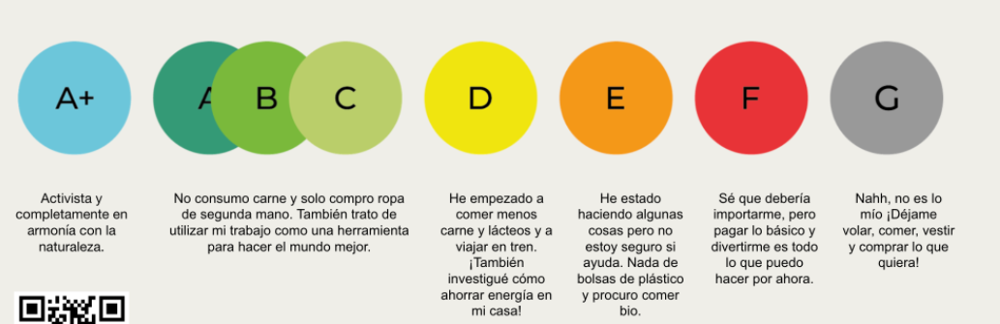
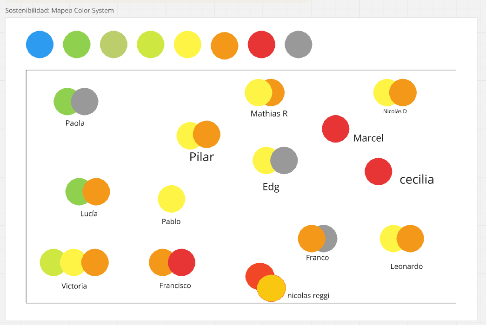
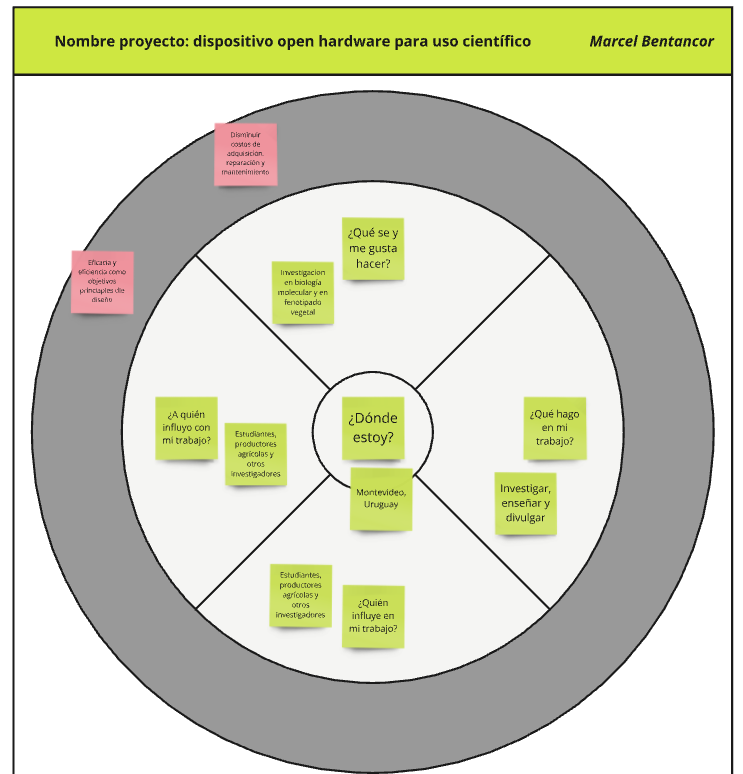
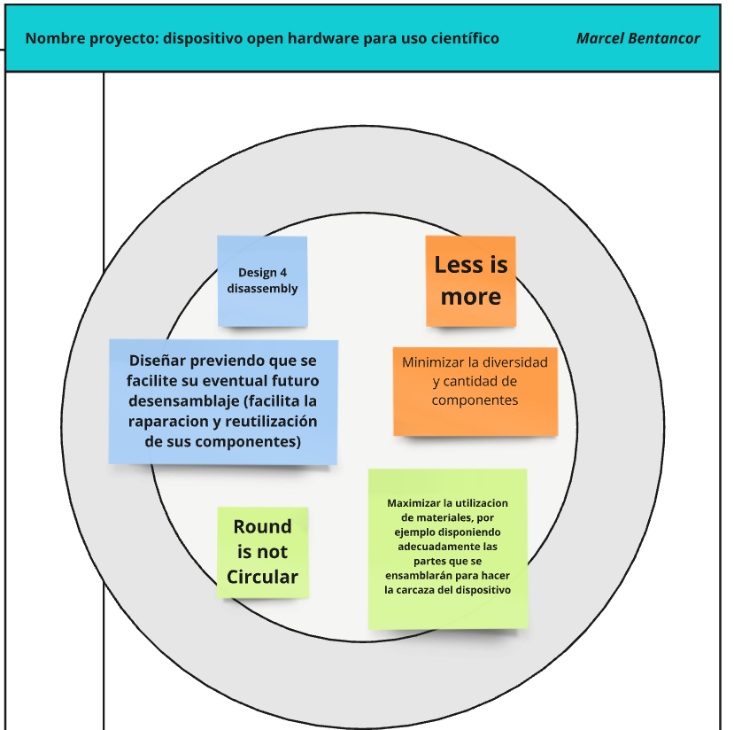

---
hide:
    - toc
---

# MI02

En este módulo la docente propició la reflexión sobre fundamentos de desarrollo sostenible y economía circular. Planteo dos ejercicios principales para que consideremos cuales de estos fundamentos elegiríamos para desarrollar nuestro proyecto. 

En primer lugar se hizo una representación gráfica de la autopercepción que tengo frente a la actitud respecto a la sostenibilidad. Si bien varias de las descripciones de las etiquetas disponibles me parecen imprecisas y a la vez faltan mencionar otras posibles actitudes, opto por elegir la etiqueta F si bien no se ajusta totalmente a la descripción de mi actitud (Figura 1). 

**Figura 1**, representacion de la autopercepción frente a la actitud respecto a la sostenibilidad. 

En la figura 2 se muestra como completé el esquema propuestao para reflexionar sobre mi proyecto. 

**Figura 2**, esquema de reflexión sobre el proyecto. 

De entre los fundamentos enseñados sobre del desarrollo sostenible y la economía circular, elegir tres para ser vinculados a mi proyecto en esta etapa. 

**Figura 3**, desarrollo de algunos de los fundamentos del desarrollo sostenible y la economía circular en el contexto de mi proyecto. 