---
hide:
    - toc
---

# Título del proyecto: 
Desarrollo en modalidad open hardware de un equipo calorimétrico. 

# Objetivo: 
Contribuir a la fabricación de un equipo calorimétrico automatizado apto para su uso en docencia universitaria. 

# Introducción

Dispositivos de uso científico desarrollados en modalidad open hardware. 
A partir de la experiencia laboral propia y la consulta con diferentes colegas, se buscó identificar situaciones y contextos temáticos donde fuera factible la incorporación en laboratorios de dispositivos desarrollados en modalidad open hardware. Considerando los recursos disponibles para este proyecto y el alcance del mismo en el marco de la EFDI, es que se optó por el desarrollo de un equipo calorimétrico automatizado. 

Los temarios de asignaturas cómo química general o fisicoquímica en la universidad a menudo incorporan el estudio de termodinámica y termoquímica. Este es el caso del curso de Fisicoquímica-I de la Facultad de Ciencias (UDELAR) del cual formé parte como docente durante varios años y el cual trata estos temas tanto desde el punto de vista teórico como práctico. Dentro de éste una de las prácticas que se ejecuta es el estudio termoquímica de diversas reacciones químicas. Este fue uno de los contextos identificados en los que la incorporación de nuevo hardware, desarrollado en forma abierta, pudiera ser de utilidad. En colaboración con el Dr Eduardo Méndez, responsable del Laboratorio de Biomateriales (Facultad de Ciencias, UdelaR) se diseñó un calorímetro automatizado apto para ser usado en las prácticas de este curso u otros cursos que incluya el estudio de la termoquímica. Con el mismo se busca mejorar los registros que puedan obtener los estudiantes durante las clases, colectando más puntos, con mayor exactitud y frecuencia respecto a la forma tradicional de hacer estas prácticas, mediante la operación manual de termómetros de mercurio. A su vez, esto permitirá sustituir el uso de estos instrumentos disminuyendo así las probabilidades de rotura accidental y la consiguiente exposición al mercurio, un reconocido agente neurotóxico. 

Termoquímica, 
Las reacciones químicas y los procesos físicos, como la disolución o los cambios en estados de agregación de la materia, están asociados a intercambios de calor con su entorno. Estos pueden absorber calor del entorno o liberarlo hacia él. Según esto, las reacciones o procesos se clasifican como endotérmicos, si absorben calor, y exotérmicos, si liberan calor (Figura 1).
Título del proyecto: 
Desarrollo en modalidad open hardware de un equipo calorimétrico. 

# Objetivo: 
Contribuir a la fabricación de un equipo calorimétrico automatizado apto para su uso en docencia universitaria. 

# Introducción

## Dispositivos de uso científico desarrollados en modalidad open hardware. 
A partir de la experiencia laboral propia y la consulta con diferentes colegas, se buscó identificar situaciones y contextos temáticos donde fuera factible la incorporación en laboratorios de dispositivos desarrollados en modalidad open hardware. Considerando los recursos disponibles para este proyecto y el alcance del mismo en el marco de la EFDI, es que se optó por el desarrollo de un equipo calorimétrico automatizado. 

Los temarios de asignaturas cómo química general o fisicoquímica en la universidad a menudo incorporan el estudio de termodinámica y termoquímica. Este es el caso del curso de Fisicoquímica-I de la Facultad de Ciencias (UDELAR) del cual formé parte como docente durante varios años y el cual trata estos temas tanto desde el punto de vista teórico como práctico. Dentro de éste una de las prácticas que se ejecuta es el estudio termoquímica de diversas reacciones químicas. Este fue uno de los contextos identificados en los que la incorporación de nuevo hardware, desarrollado en forma abierta, pudiera ser de utilidad. En colaboración con el Dr Eduardo Méndez, responsable del Laboratorio de Biomateriales (Facultad de Ciencias, UdelaR) se diseñó un calorímetro automatizado apto para ser usado en las prácticas de este curso u otros cursos que incluya el estudio de la termoquímica. Con el mismo se busca mejorar los registros que puedan obtener los estudiantes durante las clases, colectando más puntos, con mayor exactitud y frecuencia respecto a la forma tradicional de hacer estas prácticas, mediante la operación manual de termómetros de mercurio. A su vez, esto permitirá sustituir el uso de estos instrumentos disminuyendo así las probabilidades de rotura accidental y la consiguiente exposición al mercurio, un reconocido agente neurotóxico. 

## Termoquímica. 
Las reacciones químicas y los procesos físicos, como la disolución o los cambios en estados de agregación de la materia, están asociados a intercambios de calor con su entorno. Estos pueden absorber calor del entorno o liberarlo hacia él. Según esto, las reacciones o procesos se clasifican como endotérmicos, si absorben calor, y exotérmicos, si liberan calor (Figura 1).

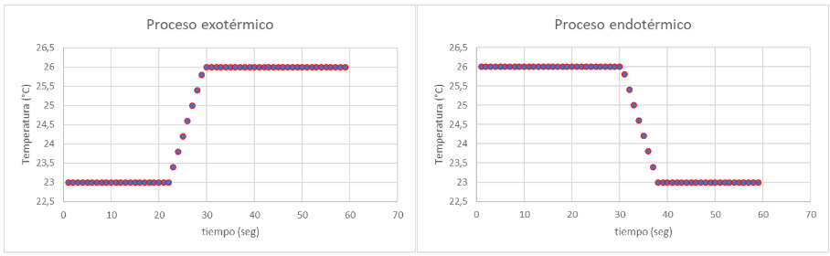
**Figura 1.** Esquema de los cambios de temperatura registrados para procesos o reacciones exotérmicas (izquierda) y endotérmicas (derecha).  

Para determinar la cantidad de calor liberada o absorbida en una reacción química, es necesario aislar la reacción de su entorno. Esto permite asociar el cambio de temperatura exclusivamente a la cantidad de calor intercambiada, eliminando la interferencia causada por la pérdida o ganancia de calor hacia o desde el ambiente. Los reactores químicos utilizados en estos estudios son recipientes adiabáticos equipados con sensores de temperatura y mecanismos de agitación, los cuales garantizan condiciones uniformes en el interior del reactor. Estos dispositivos se conocen como calorímetros o bombas calorimétricas, según funcionen a presión constante o a volúmen constante. 

El efecto térmico de estas reacciones o de procesos físicos, como la disolución, deben ser tenidos en cuenta para poder llevar a cabo las reacciones en forma segura. O en algunos casos para poder aprovechar el cambio de temperatura que pueden generar, por ejemplo para refrigerar determinados ambientes o calefaccionar otros. Una aplicación práctica de esto, son los envases de alimentos que integran un espacio con reactivos químicos, que al ser mezclados o disueltos, logran calentar la comida sin necesidad de un equipo calefactor externo. Para la cuantificación del calor liberado o absorbido es esencial contar con un calorímetro. 

Los objetivos específicos de este proyecto se distribuyen en tres ejes: 

**Tecnología y fabricación** 
Este proyecto implicó desarrollar tanto el hardware como el software del equipo fabricado. 

Se empleó impresión 3d, como técnica digital de fabricación aditiva para modificar la estructura de un recipiente adiabático (termo) para permitir así la incorporación de medios electrónicos de monitorización y comunicación. Para esto usó una placa programable Arduino UNO a la que se conectó una sensor de temperatura Dallas DS18B20 a través de una placa PCB experimental. 

**Diseño** 
Para el diseño del equipo se contó con la opinión de investigadores del área fisicoquímica, química y de desarrollo de hardware. Se contemplaron las necesidades de los docentes que incluyeron: 
- velocidad de respuesta suficientemente alta
- robustez frente al manejo por parte de estudiantes. 
- obtener una exactitud de al menos 0,1°C. 
- estabilidad térmica del contenedor adiabático
- confiabilidad en la comunicación de datos
- manejo mediante interfaz gráfica de usuario
- posibilidad de agitación constante en el interior del contenedor. 
- la adiabaticidad el contenedor tiene que ser suficientemente buena como para mantener una temperatura estable durante intervalos de al menos 10 minutos frente a un gradiente térmico de 10 grados con respecto a su exterior. 

Para la identificación de estos requerimientos y su satisfacción, se estableció un calendario de intercambios con las personas provenientes de diferentes disciplinas, y con quienes probaron el equipo. De esta forma pudo implementarse un plan de co-creación interdisciplinaria. 

El calorímetro aquí creado permitirá a comunidades educativas acceder a un dispositivo digital de precisión con menores costos de adquisición y de reparación. Adicionalmente su proceso de diseño y fabricación será enviado para su publicación en una revista arbitrada, lo cual garantizará su revisión por pares, su difusión a nivel internacional. 

## Innovación y sostenibilidad
Para este dispositivo se empleó un contenedor adiabático originalmente pensado para el consumo de bebidas calientes o frías, producido masivamente, con lo cual se logra reutilizar y aprovechar un elemento relativamente económico, pero con una finalidad más sofisticada. La unidad electrónica de monitorización y comunicación, al hacerse mediante diseño abierto , permitirá a los usuarios adaptar la confección de nuevas unidades de acuerdo al tipo de contenedor del que se disponga. El bajo costo, la robustez del dispositivo y su posibilidad de ser re-ensamblado luego de fallas permiten que este dispositivo tenga ventajas en cuanto a su sostenibilidad ambiental y social. La publicación del mismo en una revista arbitrada, asegura su difusión y posibilidades de replicación por la comunidad científica y educativa a nivel mundial. 
El principio clásico RRR (Reutilizar, reducir y reciclar) está contemplado en este proyecto ya que en el diseño del mismo se buscó reutilizar un contenedor disponible comercialmente, evitando de esta manera la necesidad de fabricar uno exclusivamente para obtener el calorímetro. La construcción del mismo buscó evitar la inclusión de piezas superfluas, asi como también economizar los materiales empleados. Por otro lado, varios de los componentes de este dispositivo así como la existencia de profusa documentación de su fabricación, prevista para ser publicada en una revista científica de libre acceso, buscan facilitar el reciclaje o posibilidades de una segunda vida a sus componentes, o mejoras a futuro por parte de los usuarios. Así como también frente a averías, la documentación permite en forma local su reparación. 

## ¿Qué hace?
Se trata de un dispositivo que permite monitorizar y registrar el aumento o disminución de temperatura generado por reacciones químicas o procesos físicos que ocurren en su interior. 
Junto al dispositivo se generó una interfaz gráfica de usuario, para su operación y que también permite monitorizar los cambios de temperatura del interior del contenedor en tiempo real. Esta interfaz permite hacer zoom y desplazarse por el gráfico obtenido a medida que se genera o luego de producido. Los datos de tiempo y temperatura son guardados localmente en un archivo .csv que luego puede ser procesado para posteriores análisis con software de planillas de cálculo como MS Office Excel. 

## ¿Cómo llegaste a la idea?
Discutiendo con docentes colegas, entre los cuales estaba el profesor Dr. Eduardo Méndez quien me planteó la necesidad de contar con un reactor químico en el cual fuera posible registrar en tiempo real y con buena exactitud los cambios de temperatura que ocurrieran en su interior. 

## ¿Quién lo ha hecho de antemano? (referencias si las hay)
Existen algunos antecedentes de equipos calorimétricos construidos por equipos de investigación y publicados en forma arbitrada (Diogo et al. 1992, Ngeh et al. 1994, Wadsö et al. 2001, Stanksu et al. 2011, Lopez-Gazpio 2020). El equipo desarrollado por Lopez-Gazpio (2020) es un equipo de con un número relativamente alto de componentes y que usa un display LCD para mostrar las lecturas de temperatura, debiendo ser registrados manualmente. En este proyecto se buscó aprovechar la conexión a una PC, para guardar los datos automáticamente dejándolos listos para post procesar, y además, poder visualizar los valores de temperatura en tiempo real. 

## ¿Qué diseñaste?
Diseñé una unidad de monitorización y comunicación integrada a un contenedor adiabático, consistente en una jarra térmica comercial (figuras 2 y 3). Se aprovechó que este contenedor tiene un sistema eléctrico de agitación, lo cual permite uniformizar más rápidamente las condiciones de reacción en el interior del contenedor.  

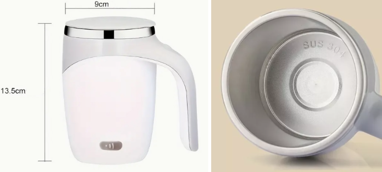
**Figura 2.** Aspecto general externo (izquierda) e interno (derecha) de la jarra comercial empleada como contenedor adiabático del calorímetro. 

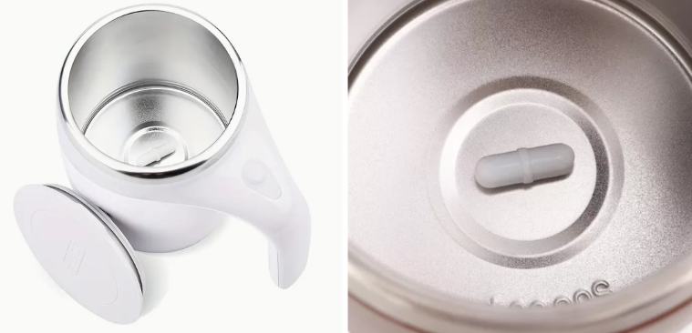
**Figura 3.** Una pastilla magnética es incluida en el recipiente, la cual se somete a rotación usando un motor incorporado de la base del mismo. 

## ¿Qué materiales y componentes se utilizaron?
La lista de materiales se integra de: 
- contenedor adiabático con mecanismo eléctrico de agitación. 
- filamento PLA
- placa programable Arduino UNO
- cables de conexión y estaño para soldar. 
- sensor digital de temperatura Dallas DS18B20
- cable USB tipo A a tipo micro USB-C para la versión 1.0 del calorímetro. tipo A a tipo B para la versión 2.0.  
- equipamiento: computadora, soldador de estaño, impresora 3D FDM, alicate, pinzas. 
- placa experimental de cobre 

## ¿Qué partes y sistemas se fabricaron?
Se hizo un placa de conexiones eléctricas, y un gabinete integrado el contenedor adiabático. 

## ¿Qué procesos se utilizaron? (aditivos, sustractivos etc.)
Impresión 3D FDM (aditiva), soldadura de componentes electrónicos, conexión y programación de placa programable Arduino UNO.  Para esto se diseñó un gabinete para la placa programable y la placa PCB, además de una pieza adaptadora que permitió posicionar a éstas en la superficie externa del contenedor (figuras 4 y 5). 

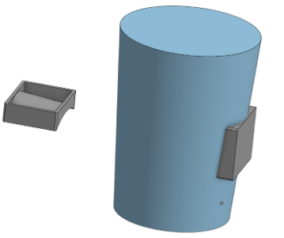
**Figura 4.** Modelado 3D con el software Onshape de la estructura principal del contenedor. Sobre el cual se modeló la base para adosar el gabinete conteniendo a la placa controladora. 

**Figura 5.** Diseño 3D del gabinete para contener la placa programable Wemos D1 Mini. Base y tapa (imágen superior) e imágenes del gabinete junto a la base para adhesión al recipiente (imágen inferior).  

## ¿Qué preguntas se respondieron?
¿Es posible construir un calorímetro de bajo costo, adaptable, y suficientemente robusto y apto para las clases prácticas?

## ¿Qué funcionó? ¿Qué no?
- Fué posible comprobar la adiabaticidad del contenedor en los tiempos de operación por al menos 10 minutos. 
- El sistema monitorizó exitosamente en tiempo real la temperatura del interior del contenedor mientras ocurre la reacción química estudiada. 
- La comunicación a través del puerto serial usando un cables USB resultó ser muy confiable, lo cual apoya la selección hecha de este tipo de comunicación en vez usar una modalidad inalámbrica como la que podrían brindar una placa ESP32 o un módulo WiFi para la placa Arduino UNO. El operario se mantiene junto al dispositivo y se requiere alta confiabilidad en el registro y comunicación de los datos, con lo cual la comunicación por cable fué la alternativa elegida. 
- Los datos se lograron guardar localmente en un archivo .csv y luego se pudieron procesar importándolos en una planilla de cálculo de MS Office Excel. 
- Se logró crear una interfaz gráfica de usuario empleando la librería Tkinter de Python. En esta interfaz se agregaron funciones de zoom y desplazamiento en el gráfico para ver con detalle los datos obtenidos (figura 6). 

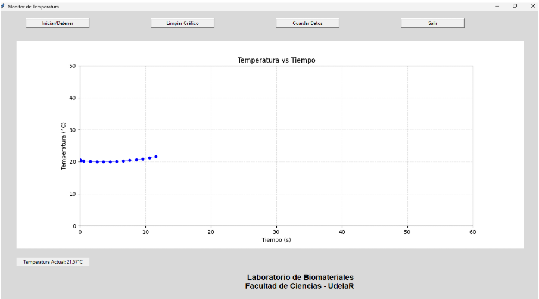
**Figura 6.** Interfaz gráfica de usuario para la operación del calorímetro creada con la librería Tkinter de Python. Consta de 4 botones, para el inicio y finalización de la toma de medidas, para guardar los datos en un archivo .csv, borrado del gráfico y para salir de la interfaz. Ésta también permite hacer zoom y desplazamiento en el gráfico. Al pie se observa la leyenda correspondiente al laboratorio con el que se ha co-creado el calorímetro.

- La interfaz gráfica permite nombrar el archivo .csv que se crea, y en el eje de las abscisas se muestra el tiempo transcurrido desde el momento en que se inició la monitorización de la computadora. 
- Fue posible comprobar diferentes resoluciones en el funcionamiento del sensor. 
- También se hizo otra versión de la interfaz gráfica con un aspecto más llamativo: usando: Node Red, pero en este caso no se logró graficar en función del tiempo relativo del experimento, sino que siempre mostraba el tiempo real en el cual cada dato era recabado. Se probó integrarle herramientas como InfluxDB o Grafana, pero no se pudo resolver este problema. En suma la interfaz gráfica creada con Python, si bien tiene un aspecto visual no tan llamativo como los que se podrían crear con estas herramientas, si logró tener una funcionalidad completa y adecuada a los requerimientos planteados por los usuarios. 
- Se hicieron dos versiones del calorímetro, en la primera se usó una placa Wemos D1 mini (figura 7) y luego en función de las placas disponibles por los usuarios finales, se generó la versión 2.0 del calorímetro empleando una placa Arduino UNO, ver figuras 8 a 11. 
- En ambas versiones se usó al sensor Dallas DS18B20 al que se lo puede configurar con resolución de 9 a 12 bits, correspondiendo esto a una resolución térmica de 0.125°C y 0.0625°C, y a velocidades de respuesta de 93.75 ms y 750 ms. Todas las pruebas se hicieron con la resolución por defecto de 12 bits.

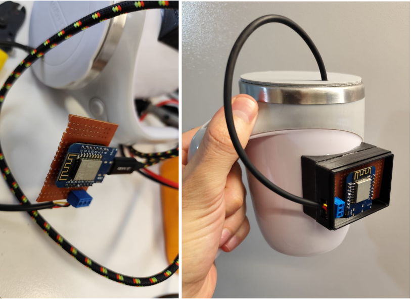
**Figura 7.** Versión 1.0 del calorímetro incorporando un sensor Dallas DS18B20 conectado a una placa programable  Wemos D1 Mini. 

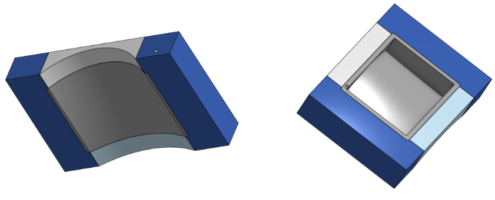
**Figura 8.** Diseño 3D generado en [Onshape](https://www.onshape.com/en/) de la base de adhesión al recipiente, adaptada para su uso con una placa Arduino UNO. 

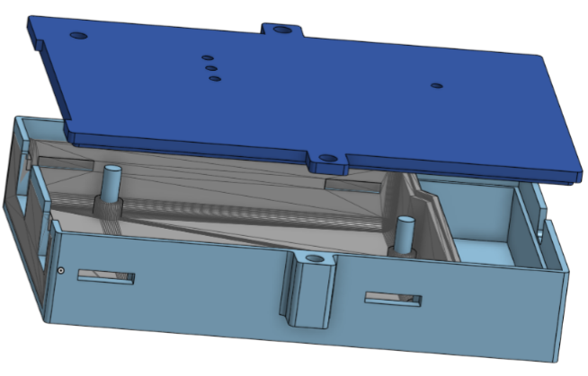
**Figura 9.** Gabinete para placa programable Arduino UNO modificada en [Onshape](https://www.onshape.com/en/) a partir de un archivo stl descargado desde la web de [Thingverse](https://www.thingiverse.com/) (mostrado en gris). 

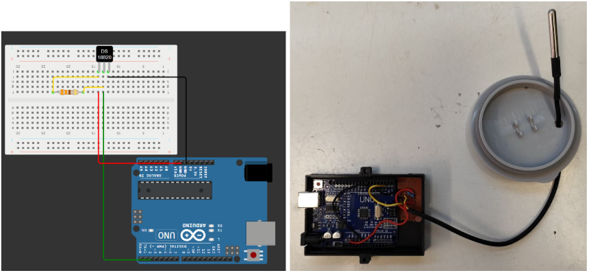
**Figura 10. **Esquema y fotografía de las conexiones del sensor térmico Dallas DS18B20 a la placa Arduino UNO. Hecho en la web [Wokwi](https://wokwi.com/). 

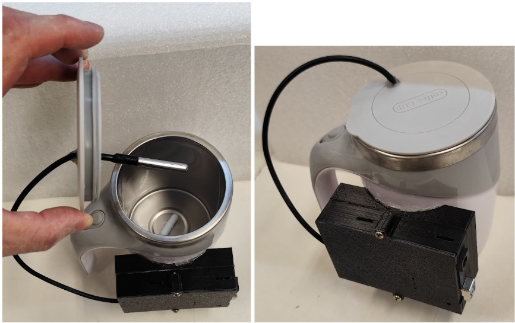
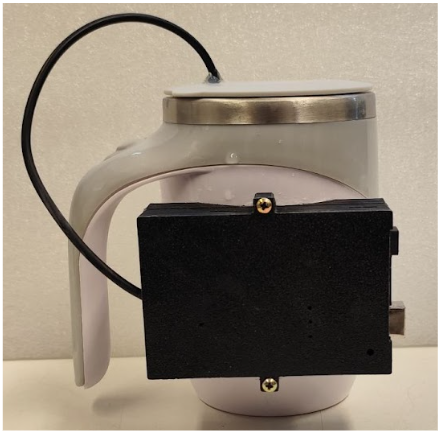
**Figura 11.** Aspecto general interno y externo de la versión 2.0 del calorímetro, usando una placa programable Arduino UNO en vez de una placa Wemos D1 Mini. 

### Validación: 
Se comprobó la funcionalidad del calorímetro versión 2.0 fabricado midiendo el ascenso de temperatura generado por la disolución de hidróxido de sodio. Lo cual se muestra en este video: calorimetro_MBentancor.mp4

## ¿Cuáles son las conclusiones?
Se logró diseñar y construir un calorímetro con registro automatizado de su temperatura interna, con alta velocidad de respuesta y suficiente exactitud para ser empleado en cursos prácticos universitarios sobre termoquímica o fisicoquímica general. 
## ¿Cuáles son los pasos a seguir
Sin comprometer la utilidad del actual prototipo, se pueden considerar varias líneas de mejora del mismo: 
- Mejorar la estanqueidad del gabinete para facilitar su manipulación en clase. 
- Se continuará la validación del calorímetro con otras reacciones químicas a fin de integrarlo a otras prácticas del curso. 
- Se hará un seguimiento durante el primer año de uso en clases, para obtener retroalimentación de docentes y estudiantes. 
- Se buscará mejorar la interfaz gráfica de usuario, para dotarla de un apariencia más atractiva y colorida (figura 12)

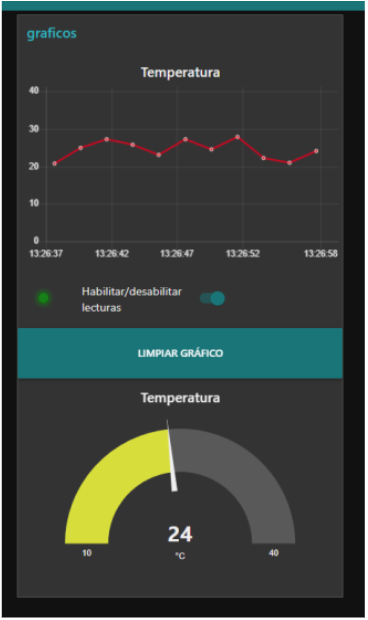
**Figura 12.** Interfaz gráfica creada usando Node-red Se muestra una prueba hecha con datos simulados desde una placa Arduino UNO. Un punto a mejorar es que se muestre el tiempo transcurrido del experimento, y no la hora real. 

### Enlaces importantes:
Script para instalar en la placa Arduino UNO: **sensor_temp_v2.ino**
Script de la interfaz gráfica de usuario: **gui,py**
Script para recepción de datos (se ejecuta desde la interfaz gráfica, por lo tanto ambos deben ubicarse en el mismo directorio): **gui_termoquimica_support_file.py**
Video de demostración: **calorimetro_MBentancor.mp4**
Archivo STL de la base del gabinete para la placa Arduino UNO: **arduino_uno_gabinete_base.stl**
Archivo STL de la tapa del gabinete para la placa Arduino UNO: **arduino_uno_gabinete_tapa.stl**
Archivo STL de la base de adhesion del gabinete para la placa Arduino UNO: **base_de_adhesion_arduino_UNO.stl**
Todos los archivos puede descargarse [desde aquí](../archivos/proyecto_final/archivos.zip). 
La presentación en formato PDF del proyecto puede descargarse [desde aquí](../archivos/proyecto_final/MBentancor_efdi_proy_final_presentacion.pdf). 

## Referencias bibliográficas 

Diogo, H. P., Minas da Piedade, M. E., Moura Ramos, J. J., Simoni, J. A., & Martinho Simões, J. A. (1992). A reaction-solution calorimeter for the undergraduate laboratory. Journal of Chemical Education, 69(11), 940-942.

Ngeh, L. N., Orbell, J. D., & Bigger, S. W. (1994). Simple heat flow measurements: A closer look at polystyrene cup calorimeters. Journal of Chemical Education, 71(9), 793-795.

Wadsö, L., Smith, A. L., Shirazi, H., Mulligan, S. R., & Hofelich, T. (2001). The isothermal heat conduction calorimeter: A versatile instrument for studying processes in physics, chemistry, and biology. Journal of Chemical Education, 78(8), 1080-1086.

Stankus, J. J., & Caraway, J. D. (2011). Replacement of coffee cup calorimeters with fabricated beaker calorimeters. Journal of Chemical Education, 88(12), 1730-1731.

Lopez-Gazpio, J., & Lopez-Gazpio, I. (2020). Constructing an electronic calorimeter that students can use to make thermochemical and analytical determinations during laboratory experiments. Journal of Chemical Education. https://dx.doi.org/10.1021/acs.jchemed.0c00281