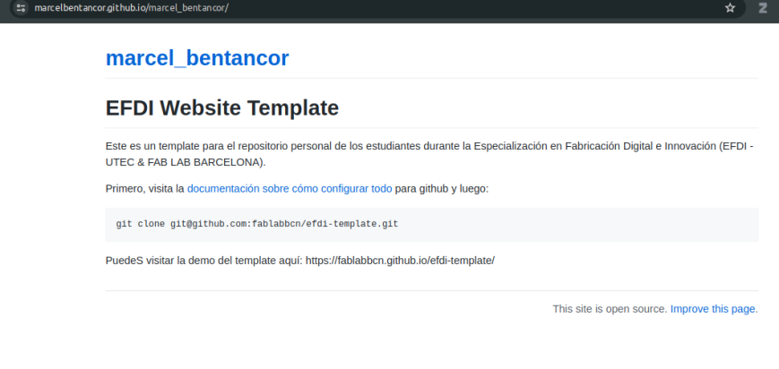
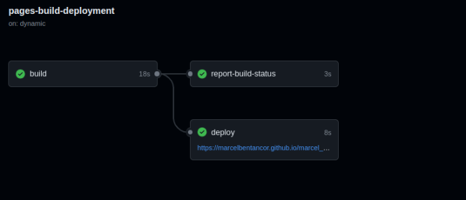
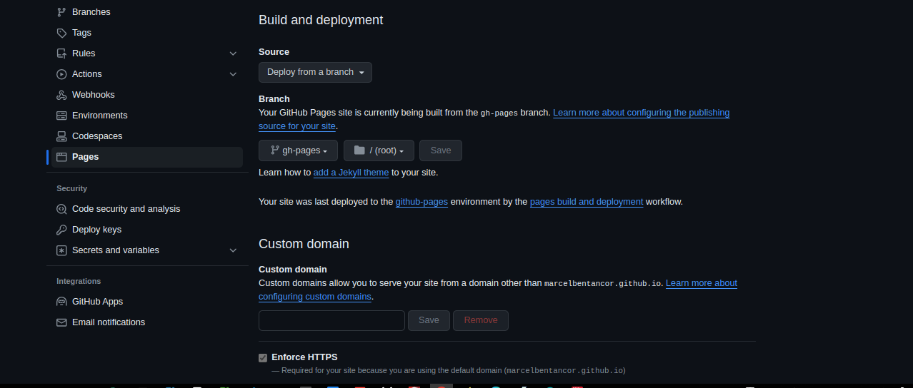
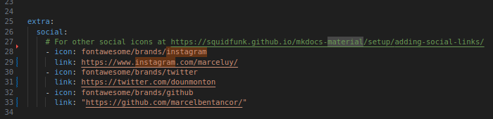

---
hide:
    - toc
---

# MT01

Para comenzar este sitio web en la unidad MT01 del posgrado, seguí los tutoriales y recursos publicados en la plataforma de UTEC. La dificultad mayor que tuve al seguir estos tutoriales fue que enla página web online no se visualizaban los cambios en el contenido que hacia en forma local, asi como tambien el aspecto era diferente al del template que descargué desde el github que hicieron los docentes, aun cuando si lograba actualizar los archivos de la página en mi fork del repositorio, en las siguientes imagenes se muestra como se veia mi web y la acción ejecutada en github: 

Tras consultar, un docente me indicó que qu estaba haciendo el deploy en un lugar diferente al /gh-pagesn de mi repositorio github (ver imagen adjunta) al corregir esto, el inconveniente se solucionó. 

En el archivo mt01.md edité los enlaces las redes sociales para dirgir sus enlaces a mis redes personales. 

Para el manejo de git y github me resultaron útiles los materiales proporcionados por los docentes y [este tutorial](https://www.youtube.com/watch?v=3GymExBkKjE&t=19s) publicado en Youtube. 