---
hide:
    - toc
---

# MT02

Para el modelado 3D usé la web Onshape, diseñada para el diseño tridimensional paramétrico. Para convertir imágenes rasterizadas a vectoriales, y para modificar a éstas, usé el programa inkscape, el cual lo instalé localmente. 
Para editar imágenes rasterizadas usé el programa Adobe Photoshop, el cual ya lo tenía instalado en mi PC . 

Elegí hacer una réplica digital de una pieza plástica de un sistema de electroforesis SDS-PAGE. Ésta es una técnica analítica que permite separar proteínas de acuerdo a su tamaño. Requiere armar un gel, generalmente vertiendo una mezcla entres dos vidrios y permitiendo que allí dicha mezcla se gelifique. Ambos vidrios se mantienen firmemente apretados por un par de piezas conocidas como compresores de geles. Existen varios modelos de estos compresores, en particular los de algunas marcas suelen sufrir roturas prematuramente en virtud de la gran compresión que deben soportar estas piezas. 
La fabricación digital podría posibilitar replicar estas piezas en materiales más duraderos que el plástico original de estas piezas, por ejemplo: usando un herramienta CNC de corte en metal o una sinterizadora 3D de metal. 

Se tomaron medidas usando un calibre y se diseñó el compresor en la web de Onshape (Figura 1). 

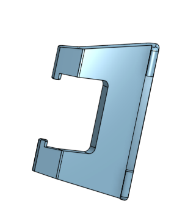
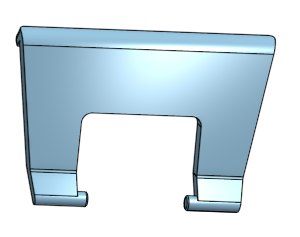
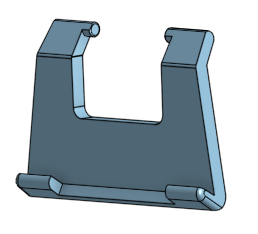
**Figura 1**, vistas lateral, frontal y trasera de la pieza diseñada, es)ta pieza se denomina compresora de geles. 

Por cada gel que se arma, se requieren dos compresores. Por lo tanto es conveniente disponer de varias de estas piezas en el laboratorio. Para eso diseñe una caja de tamaño adecuado (Figura 2) con un tapa de ajuste al milímetro (Figura 3): sobrando un milímetro de espacio interior de la tapa respecto a las medidas exteriores del cuerpo de la caja. Agregué un relieve en su parte superior que permita su fácil identificación, empleando una imagen vectorizada (Figura 4). Esta imagen se logró descargando una imagen rasterizada de un esquema de un gel electroforético, y sobre éste agregué el término “SDS-PAGE” a fin de asociar esta caja a la técnica para la que están diseñadas que contendrá en su interior. 
El proceso para obtener este relieve fué el siguiente: se buscó una imagen de un gel de electroforesis en Google images, ésta imagen rasterizada se convirtió a un formato vectorial usando el software Inkscape (Figuras 5 y 6). En este mismo programa a la imágen se le agregó el texto “SDS-PAGE” y éste texto tambiens vectorizó en ese software. La imagen final vectorizada fue guardada con extensión .DXF. Se hizo en este formato, porque la web Onshape no admite al formato SVG, pero si imágenes DXF (Figura 7). 

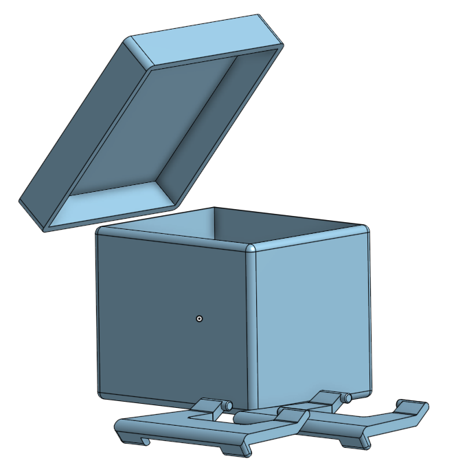
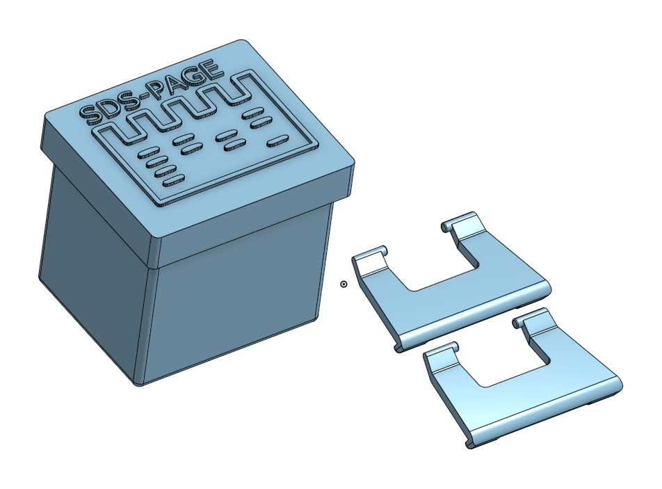
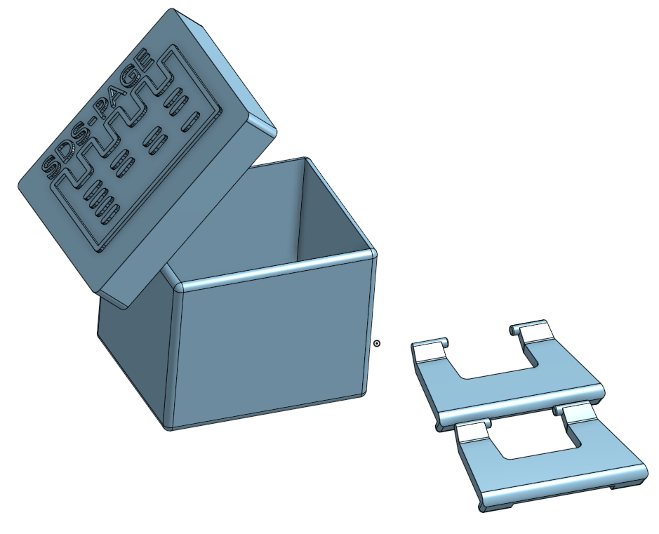
**Figura 2**, vistas generales de la caja diseñada para contener los compresores de geles. 

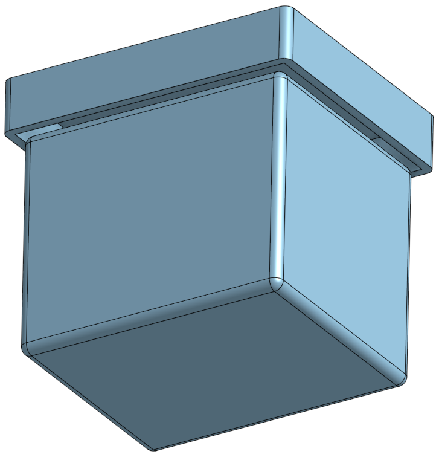
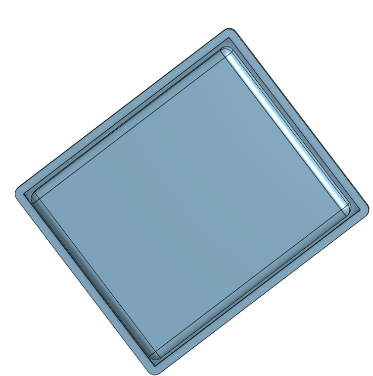

**Figura 3**, detalle del ajuste logrado entre la tapa y cuerpo de la caja contenedora de los compresores de geles. Izquierda, vista en perspectiva. Derecha, vista inferior. 

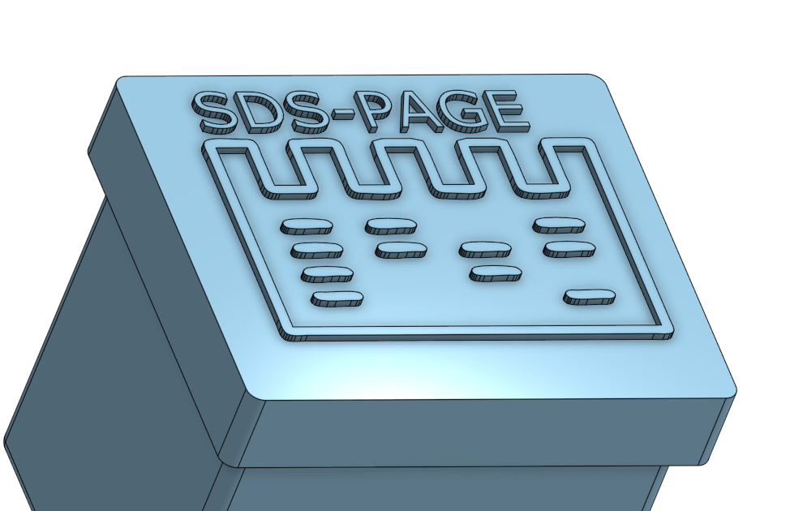
**Figura 4**, detalle del relieve de la tapa generado a partir de una imagen vectorizada insertada sobre la pieza y luego extruida. 

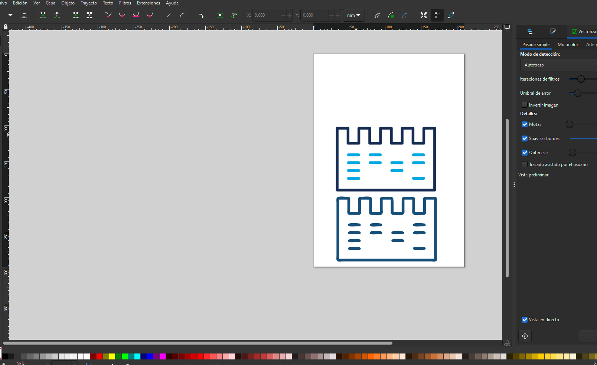
**Figura 5**, en el programa Inkscape se vectorizó la imagen (image inferior) de mapa de bits descargada de Internet (imagen superior). A la derecha se observa en detalle ambas imágenes, notándose el pixelado del mapa de bits. En ese programa también se le agregó la sigla de la técnica para completar el mapa vectorial que luego se extruyó sobre la tapa de la caja. 

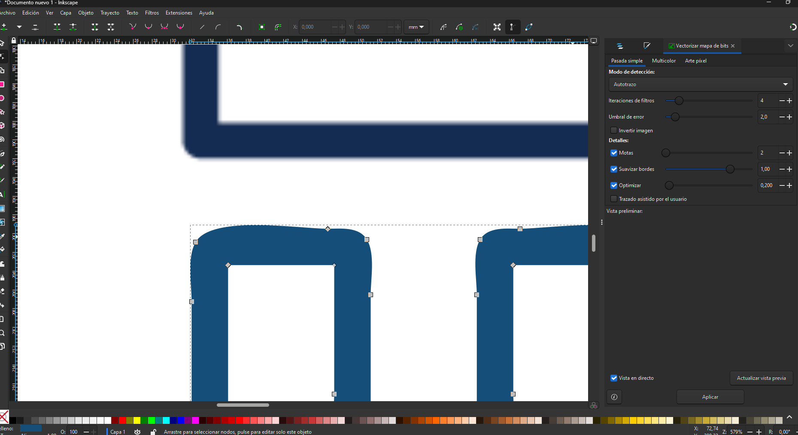
**Figura 6**, texto antes (izquierda) y luego (derecha) de ser vectorizado en el programa Inkscape. 

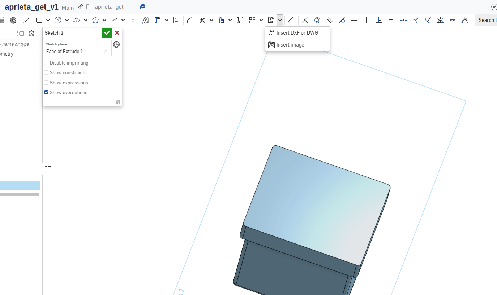
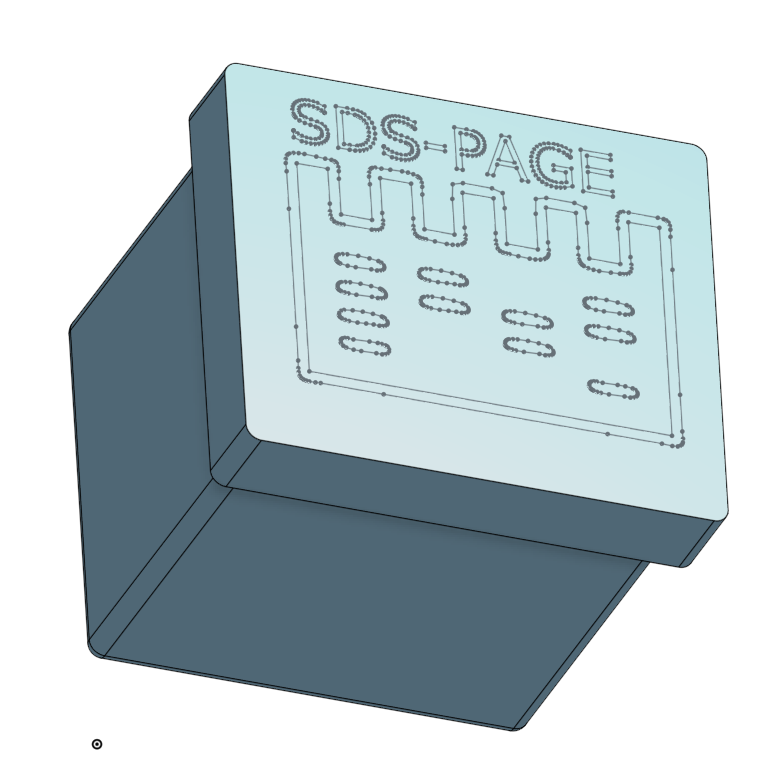

**Figura 7**, inserción del logo como formato vectorial DXF en la herramienta Onshape. En la parte inferior se observa el logo antes (izquierda) y luego (derecha) de ser extruido. 

Finalmente cada una de las tres piezas fué exportada como archivo .STL (Figura 8) desde la web de Onshape. Para visualizar en forma local estos archivos instalé el programa Visor 3D en Windows 11. 

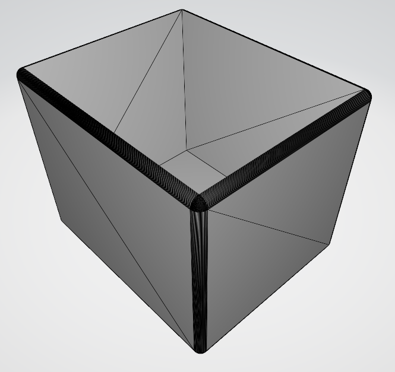
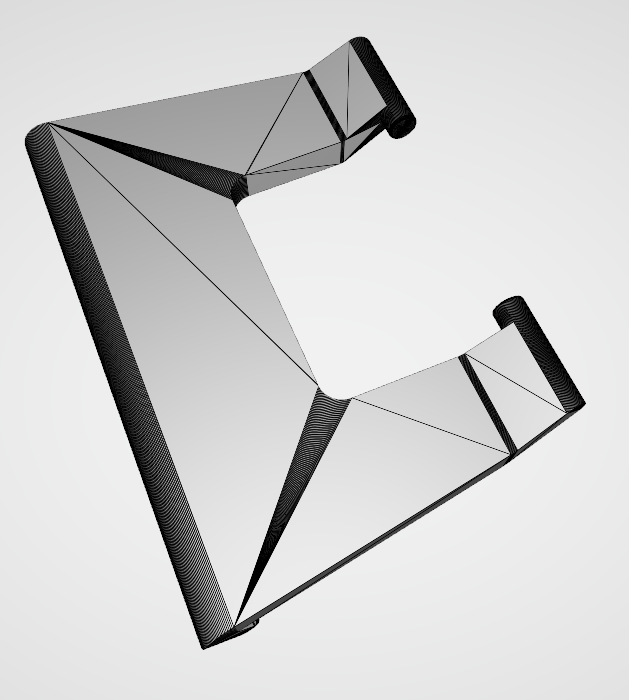
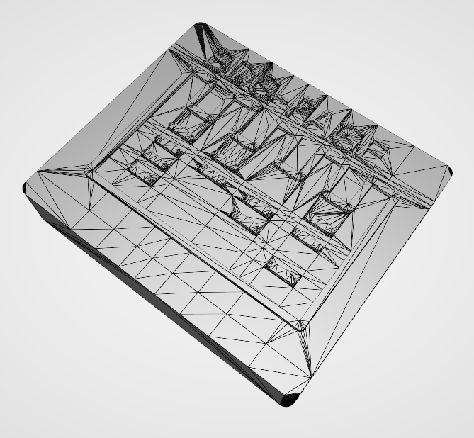
**Figura 8**, vista de las tres piezas en sus respectivos archivos en formato .STL. Visualizadas con la herramienta Visor 3D de Windows 11. 

Para hacer la lámina de este trabajo, usé el programa Adobe Photoshop, la misma se muestra en la figura 9. 

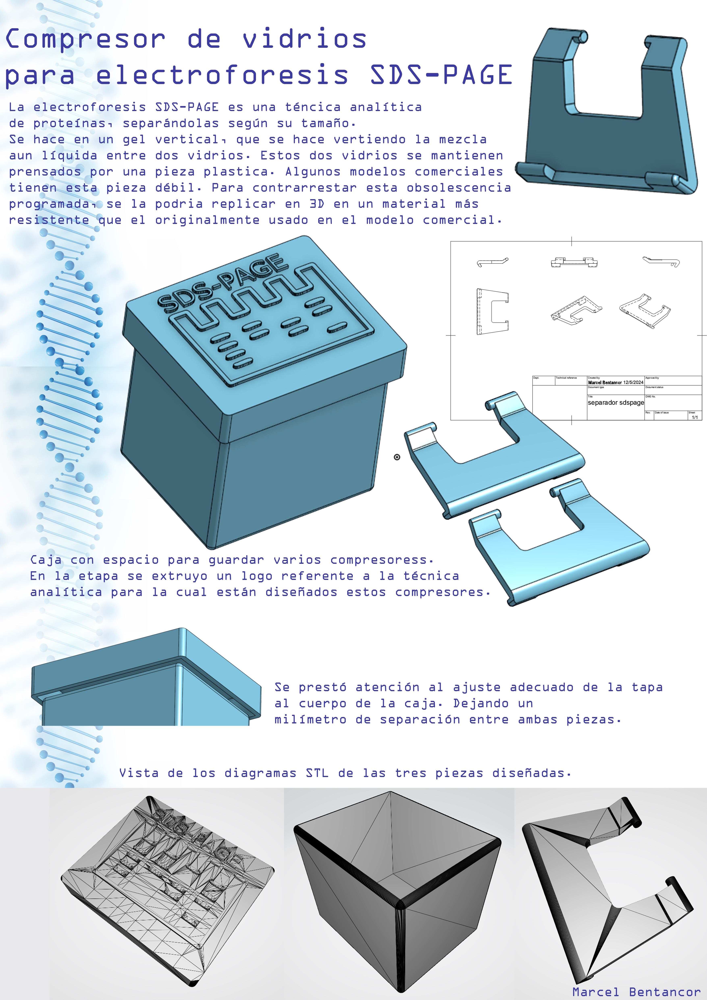
**Figura 9**, visualización de la lámina correspondiente a este trabajo. 

En la figura 10 se muestra un renderizado hecho con el programa Autodesk Fusion, en base al archivo .stl diseñado en la web de Onshape. Para este renderizado se elegió al plástico ABS blanco como material de fabricación. 

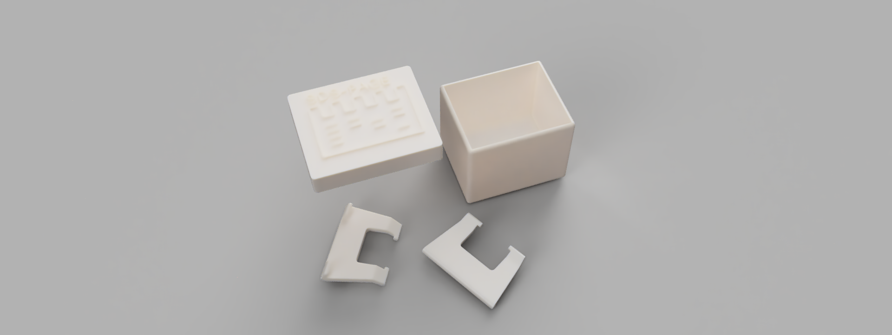
**Figura 10**, renderizado de las piezas diseñadas. 

En la figura 11 se muestra el dibujo técnico del separador de geles de acuerdo a diferentes vistas. 

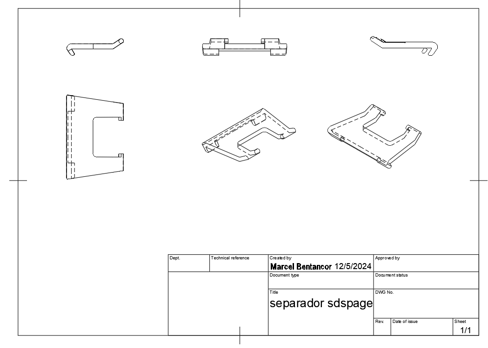
**Figura 11**, dibujo técnico del separador de geles.  

El archivo .stl de cada pieza se puede [**descargar desde aquí***](../archivos/MT02/piezas_MT02_MBentancor.zip) en único archivo .zip compactado. 
El archivo .jpg de la lámina se pude [**descargar desde aquí**](../images/MT02/fig9.jpg). 
Una animación del diseño tridimensional del compresor de geles puede [**descargarse desde aquí**](../archivos/MT02/animacion_separador_sdspage.avi)