---
hide:
    - toc
---

# MT03

En este módulo se encargó hacer una pieza usando corte láser CNC, compuesta por tres piezas unidas por encastres, sin pegamento o piezas auxiliares para unirlas. Pudiendo ser fabricada en cartón o placa MDF de 3 mm de espesor, la material total disponible para cada estudiante es de 600 x 450 mm. 

**Exploración de ideas para definir la pieza y su diseño** 
Se exploraron diversas páginas webs (thingiverse, reedit, pinterest, etc) para tener una mejor idea del tipo de piezas que pueden fabricarse haciendo uso exclusivamente del corte láser cnc con madera o cartón.
Para elegir que tipo pieza se diseñaría se tomó en cuenta: 
- Qué tuviera una utilidad pŕactica. 
- Que pudiera incorporar el uso de corte, grabado y rasterización el CNC láser, y que además pudiera incorporar una pieza con kerfing para curvar madera. 
- Fuera relativamente simple de armar con la piezas cortadas. 

El diseño general elegido fué el de un soporte para teléfono celular, hecho de dos piezas de madera encastradas entre sí. Para incorporar una pieza con kerfing, se optó por agregarle dicha pieza a modo decorativo, además de ser útil para dar una ide de la flexibilidad lograda con un cierto diseño de kerfing usado para hacer la pieza. 

**Diseño del boceto de la pieza en un editor de gráficos 3D** 
Dado que tengo más práctica en el uso del software de diseño 3D Onshape, hice un bosquejo 3D de la pieza usando esta herramienta, ver la figura 1. 

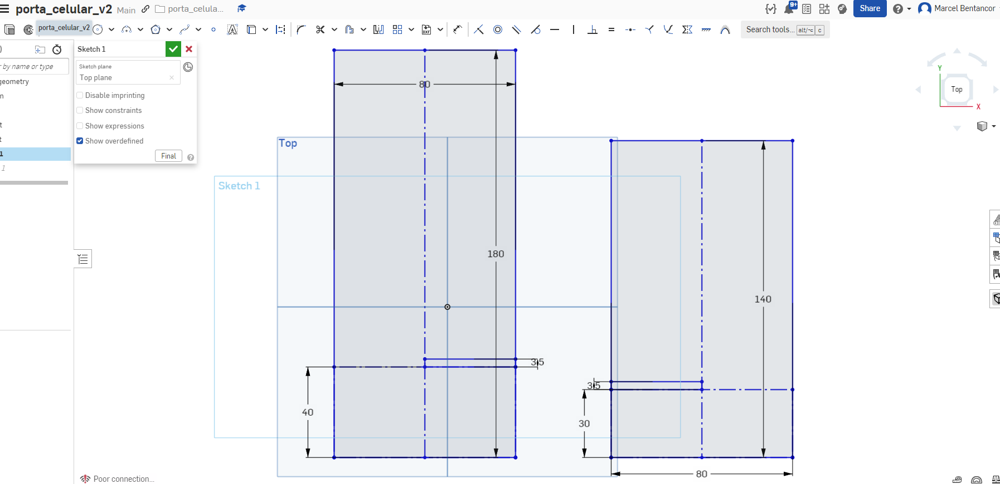
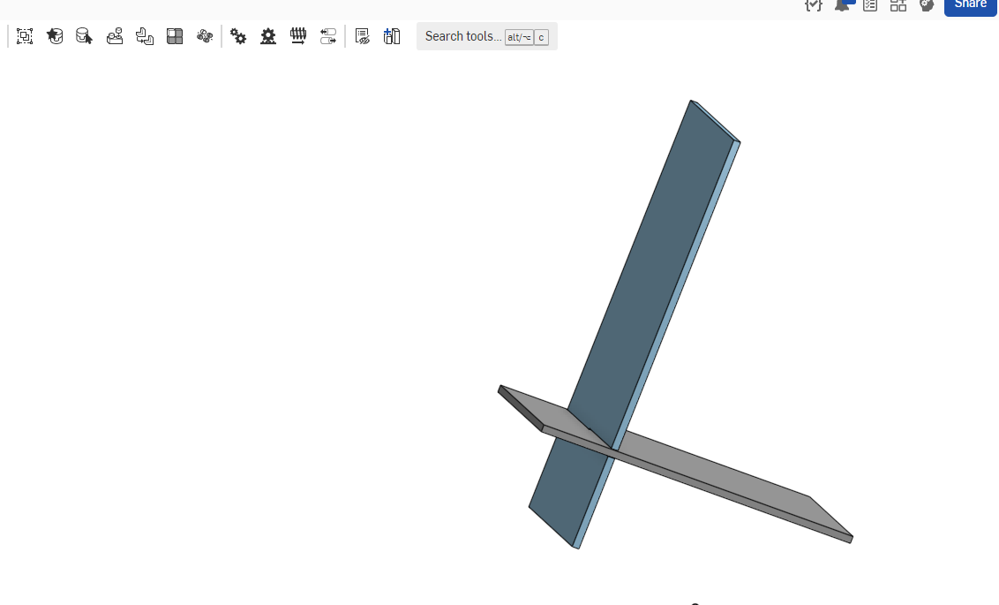
**Figura 1**, vistas generales del boceto y del bosquejo 3D de la pieza, hecho en Onshape. 

Luego, ya con una ide más clara de diseño partir del boceto hecho en Openshape, usé el programa Fusion para hacerlo, ya que busco mejorar el manejo que tengo del mismo, en particular, para lograr un diseño parametrizado. 
Tres medidas del boceto fueron  parametrizadas (figura 2): 
- espesor del material
- holgura para encastres
- espaciados para ranuras del kerfing

Las ranuras para los encastres las definí como la suma de los dos primeros parámetros (figuras 3 y 4). 

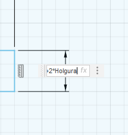
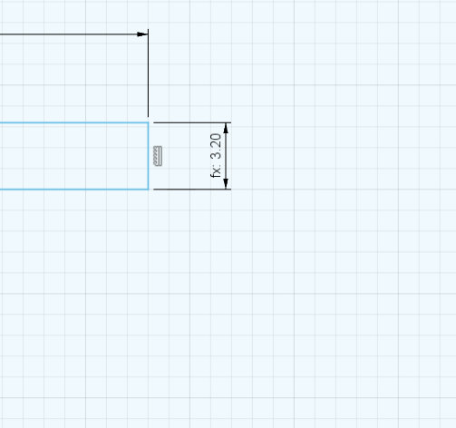
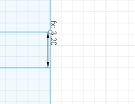
**Figura2**, detalle del boceto  mostrando algunas de las partes cuyas dimensiones fueron deifnidas de manera parametrizada. 

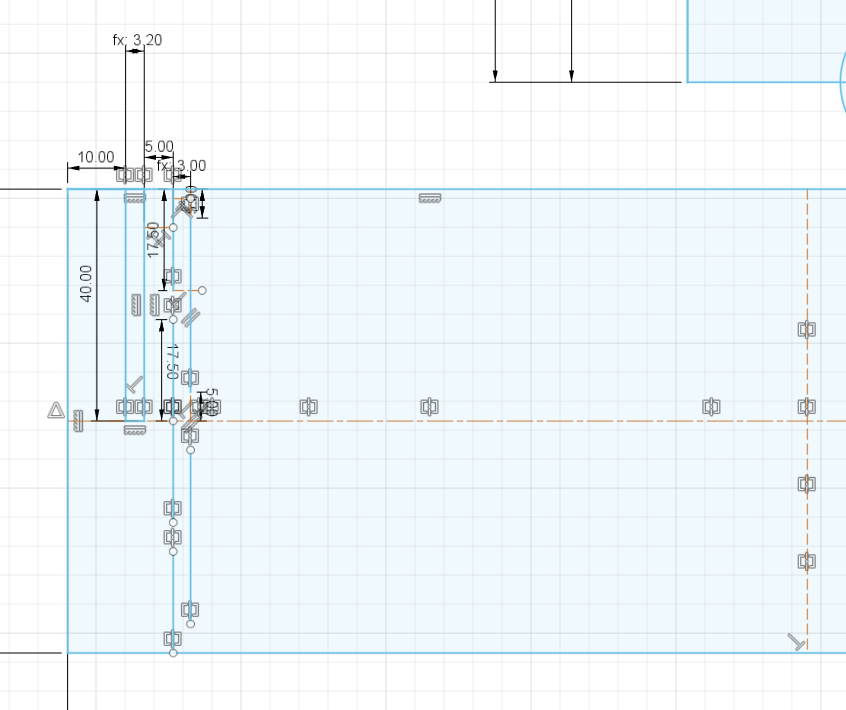
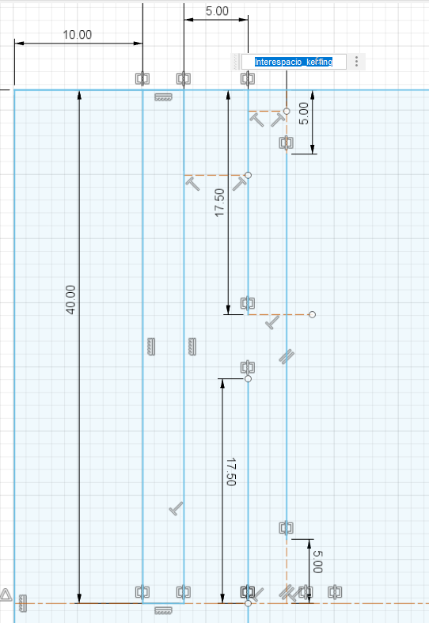
**Figura 3**, detalle de alguna de las dimensiones parametrizadas. 

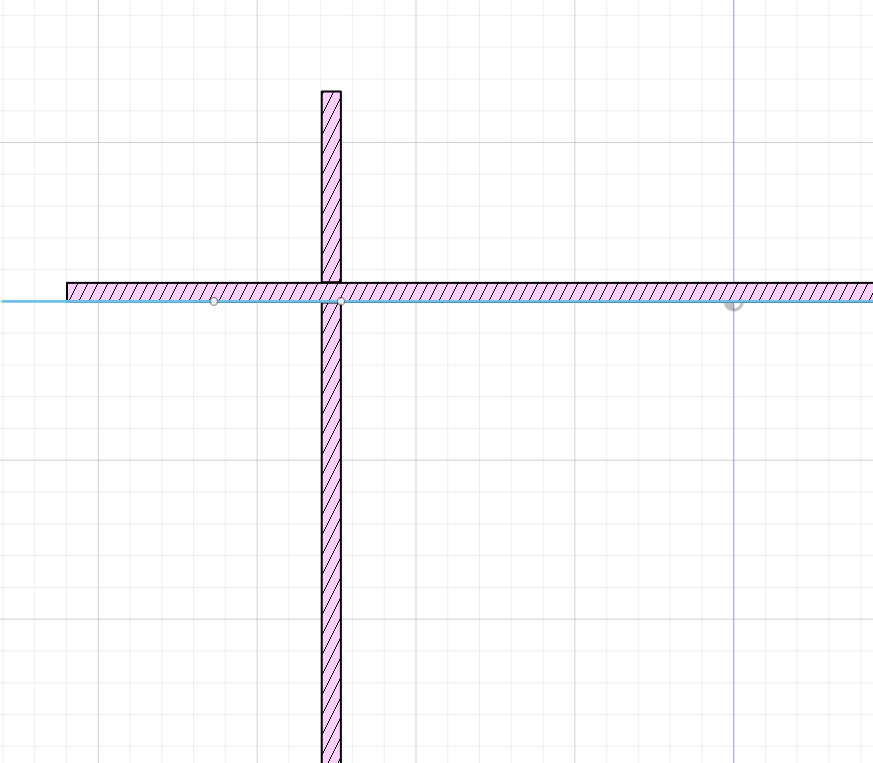
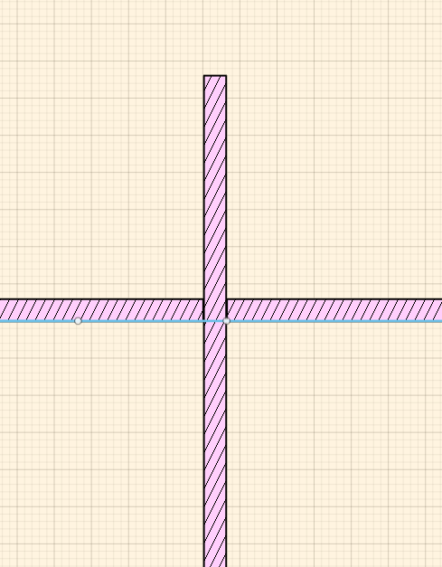

**Figura 4**, sección transversal del encastrado entre los soportes vertical y horizontal. 

A la pieza se le agregaron dos perforaciones para el pasaje del cable conector del teléfono celular. Vistas generales 3d de la pieza se muestran en la figura 5. Para hacer la banda de madera con kerfing, se hizo un diseño de kerfing empleando un patrón lineal de perforaciones. Las medidas se decidieron en base a un video demostrativo del grado de flexibilidad de diversos modelos de kerfing, mostrado en [**este video**](https://www.youtube.com/watch?v=QvcpBnxsQws)

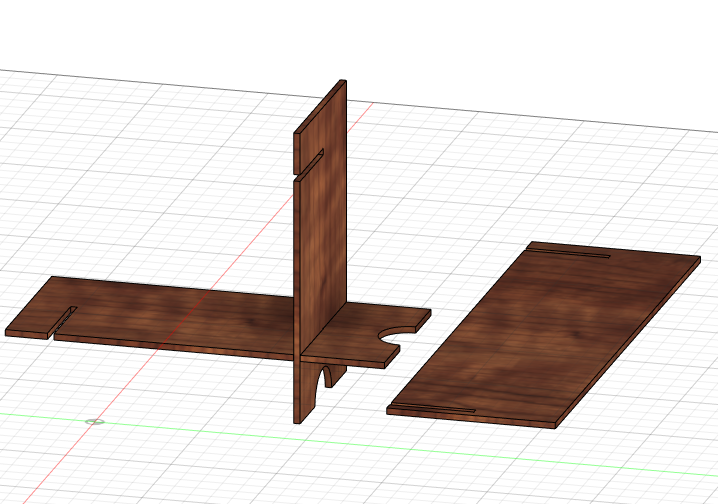
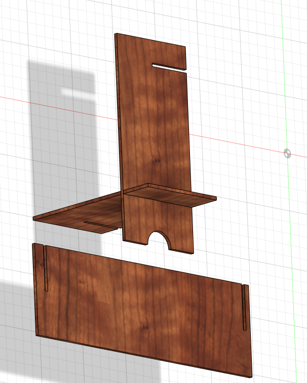
**Figura 5**, vista 3D del soporte. No se muestra la banda decorativa de madera curvada usando la técnica de kerfing. 

**Procesamiento del diseño en un editor de gráficos vectoriales** 
El boceto exportado como archivo .dxf desde el programa Fusion, fue importado en un documento del programa Inkscape. Usando la herramienta de medición se obtuvo la medida del ancho de uno de los soportes, y se calculo la relacion respecto a la medida real o desesada. Usando ese factor de escalabilidad se transofrmó el tamaño de las piezas, teniendo cuidado de conservar la relación de proporciones entre el ancho y la altura. 

Luego se hicieron estas etapas: 
- Se inspeccionó el diseño para encontrar lineas superpuestas, y en caso de haberlas, se eliminó a una de ellas. 
- Eliminación de líneas innecesarias, por ejemplo: media circufeerencia de las correspondientes a cada perforación incluida en el diseño. 
- Unificación de las líneas formando cada pieza individual, haciendo uso del comando "Trayectorias > Combinadas". 

Resultados parciales de estas acciones se muestran en la figura 6. 

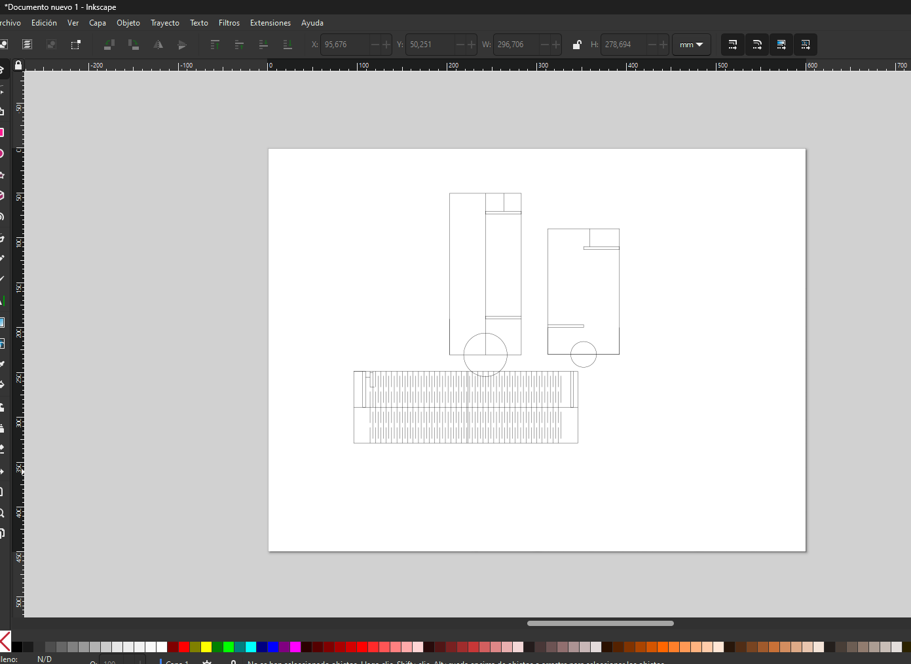
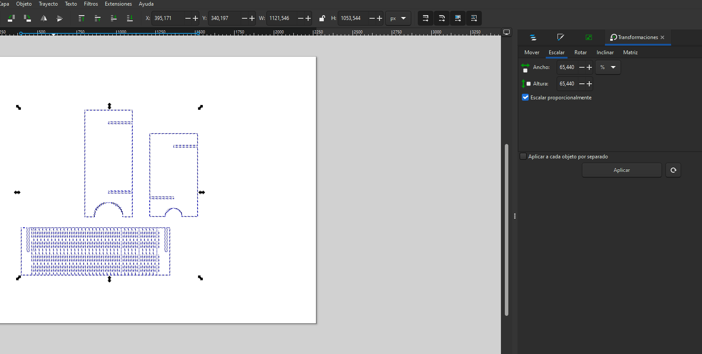
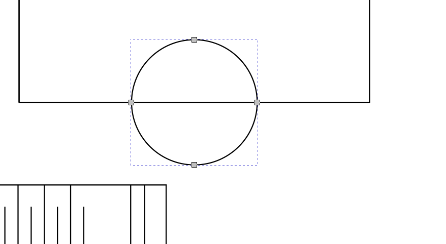
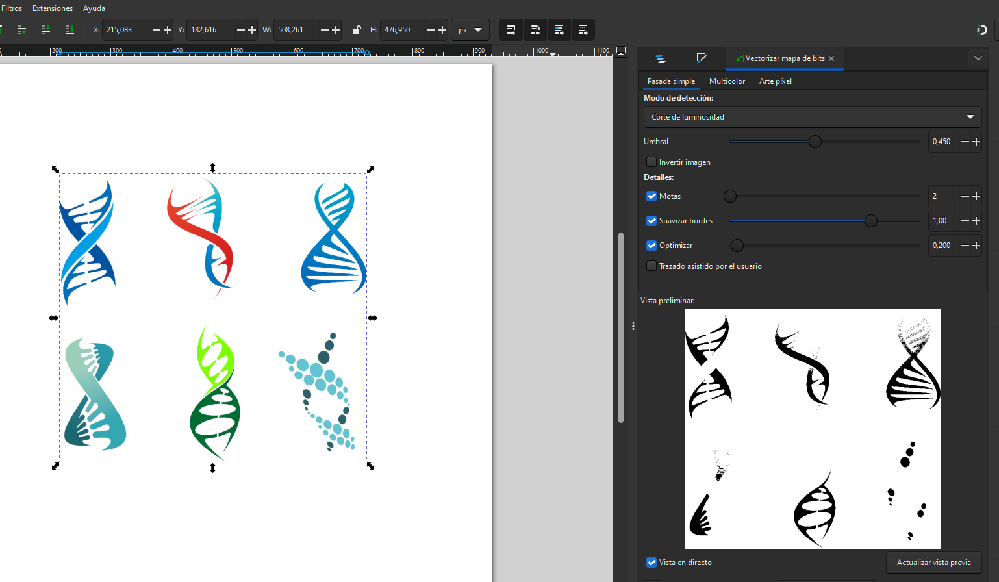
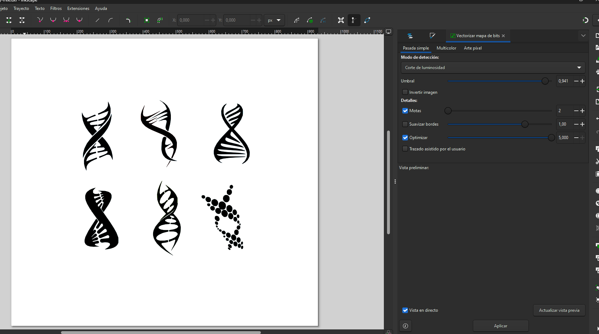
**Figura 6**, imágenes representativas de la edición del boceto en el programa Inkscape y detalle de la vectorización de figuras descargadas de Internet. 

Luego busqué en internet figuras libres sobre ADN  e inteligencia artificial, las importé en Inkscape y allí las vectoricé. Cambié las opciones de vectorizado de tal forma de mantener un nivel de detalle relativamente alto. En Inkscape, usando la herrmaienta de inserción de texto incluí mi nombre en la  (Figura 7). 
También diseñé una grilla de 9 x 9 cuadraddos, para que el soporte tmabien sirva como referencia sobre los valores de velocidad y ptencia del laser y cual es su efecto sobre el rasterizado de imágenes en el soporte que se empleará para esta pieza. En esta pare usé herramietnas básicad de alineamiento, distribucioón y rotacion que brinda Inkscape. 

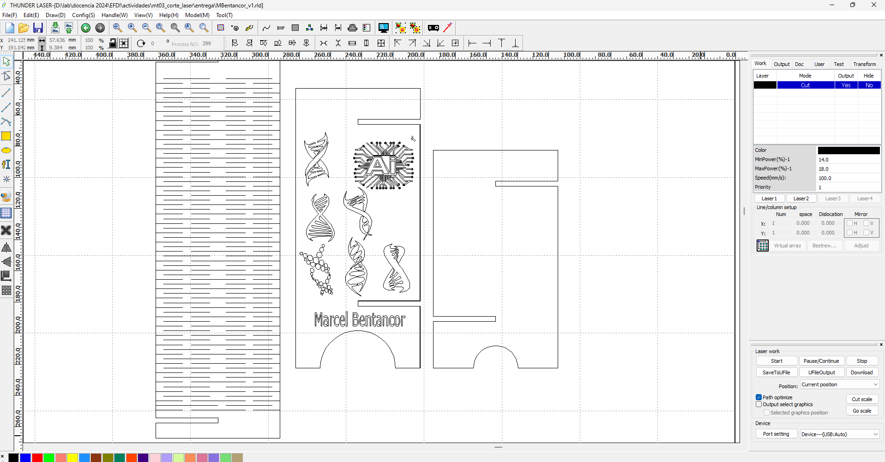
**Figura 7**, disposición en rdworks de las figuras diseñadas. 

**Procesamiento en el software rdworks** 
El boceto vectorial procesado se guardó, continuando con su formato .dxf, y luego se importó en el programa rdworks. Este programa el tipo CAM toma el diseño hecho con los otros programas, que asistieron al diseño como programas del tipo CAD. 

Se verificó el tamaño del diseño, y reecalándolo de ser necesario para mantener las dimenciones deseadas desde un comienzo. Se distribuyeron los diseños de las diversas piezas de tal forma de minimizar los desperdicios de material. 

Se seleccionaron diferentes figuras de acuerdo a su destion en el CNC láser: corte, grabado o rasterizado. A cada destino le corresponde una capa diferente, para cuya configuración se siguió el tutorial incluido por el docente encargado de este módulo técnico. 

Para la grilla de referencia de rasterizado, tambien se configuraron nuevas capacas con diversos valores de velocidad y potencia del láser (Figura 8). 

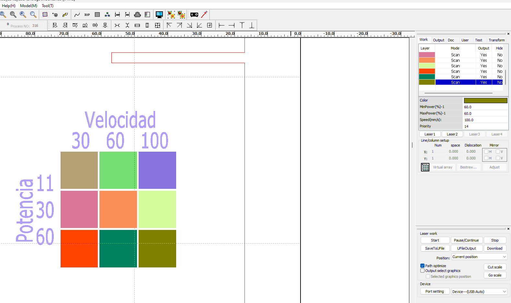
**Figura 8**, detalle de la configuracion de capas usada para rasterizar la grilla de referencia. 

Para evitar movimientos de la pieza mientras la procesa el CNC láser, las capas de trabajo del láser se ordearon (de arriba hacia abajo) de esta forma (Figura 9): rasterizado (scan), grabado (cut), corte (cut, se llama igual pero tiene configuracion diferente a la usada para el grabado). 

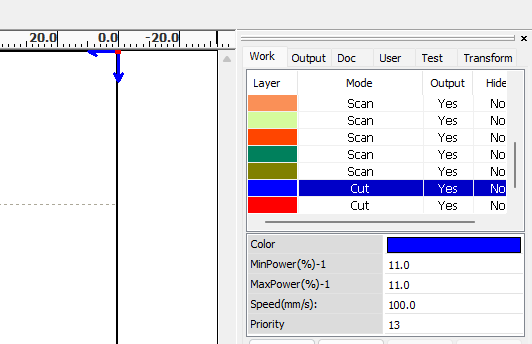
**Figura 9**, orden de capas de procesamiento del CNC láser. 

Luego de configurados los diferentes tipos de operación del láser para cada una de las trayectorias vectoriales del diseño (Figura 10) se guardó el archivo .rld, y se exportó el gcode bajo la forma de un archivo .rd. 
El formato .rd es un archivo del tipo binario y su formato es propietario, por lo tanto no puede visualizarse correctamente con un editor de texto, sino que debe ser leído con el programa rdworks. 

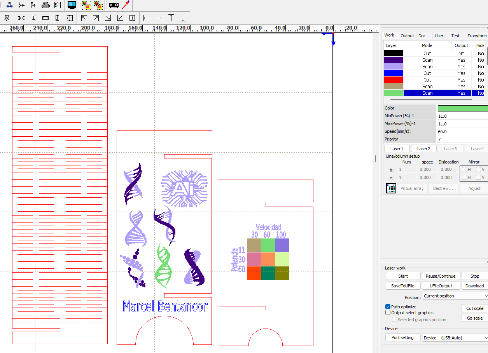
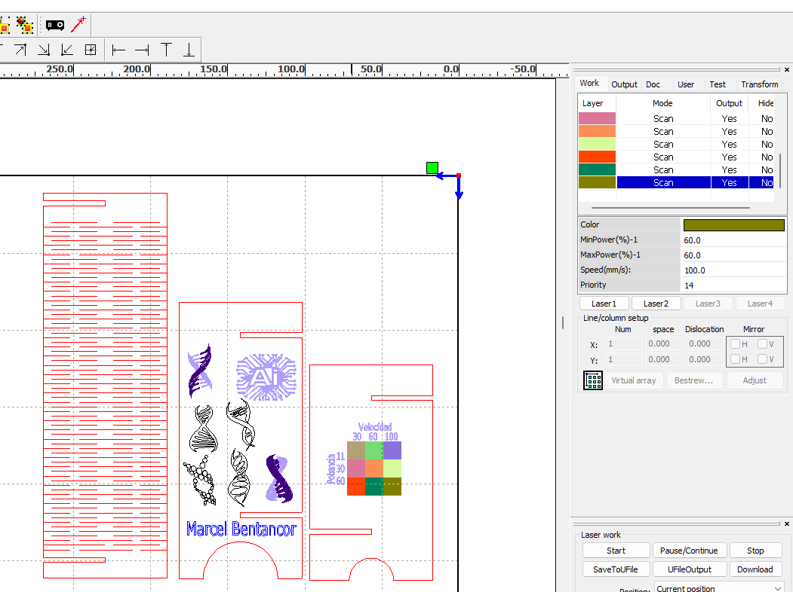
**Figura 10**, vista general del diseño procesado en rdworks. 

Se hizo la previsualización del trabajo, el cual insumiría unos 18 minutos en completarse (Figura 11).

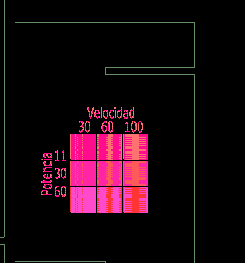
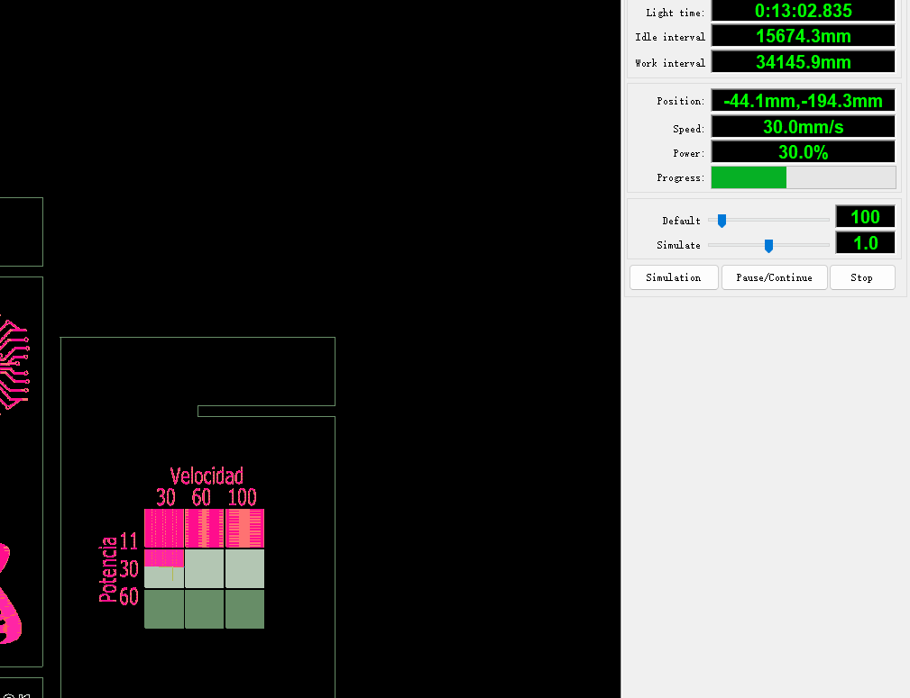
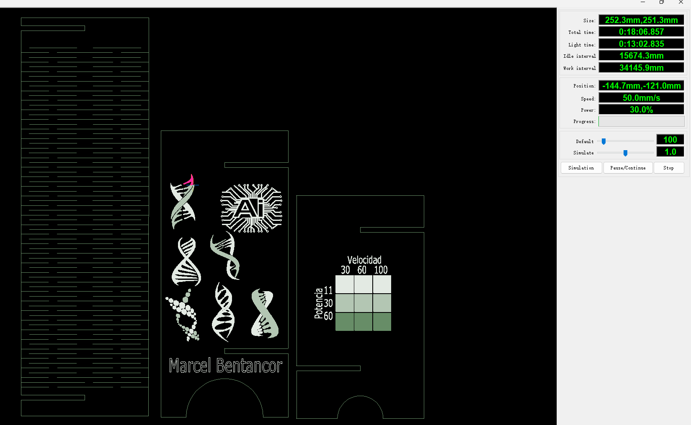
**Figura 11**, vistas de la previsualización del trabajo en el CNC láser, de acuerdo al programa rdworks. 

Los archivos .dxf. rld y de g-code (en formato .rd) pueden [**descargarse desde aquí**](../archivos/MT03/piezas_MT03_MBentancor.zip) en un único archivo .zip compactado. 

Este archivo compactado, en total, contiene a los siguientes archivos: 
-MBentancor_v1.rd, archivo con g-code, generado por rworks. 
-MBentancor_v1.rld, archivo con diseño completo de la pieza, generado en rworks. 
-portacelular_laser_v1.dxf, diseño vectorial de las tres piezas que compoen el soporte (diseño sin vectores de rasterizado)

Los vectores usados para rasterizado de figuras están en la subcarpeta "figuras" que también se descompacta desde el archivo .zip: 
-ai_circuit.dxf
-cuadricula.dxf
-favpng_dna-vector-genetics-royalty-free.dxf

