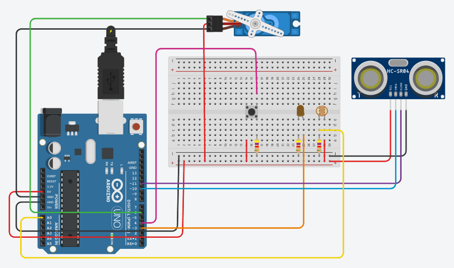
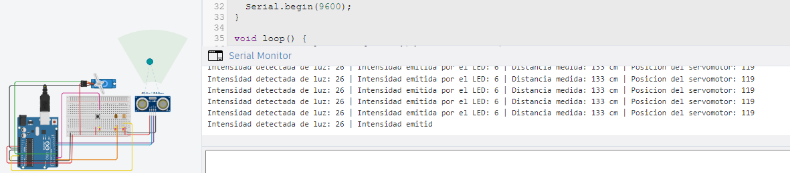
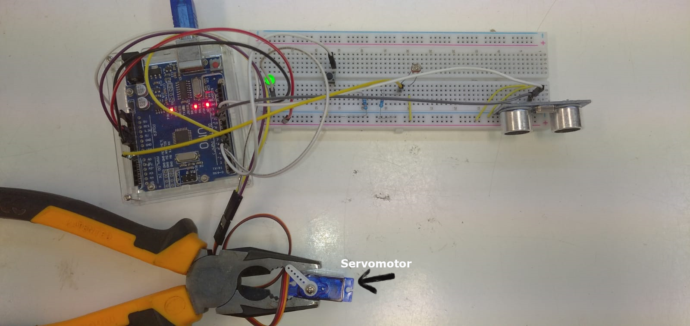
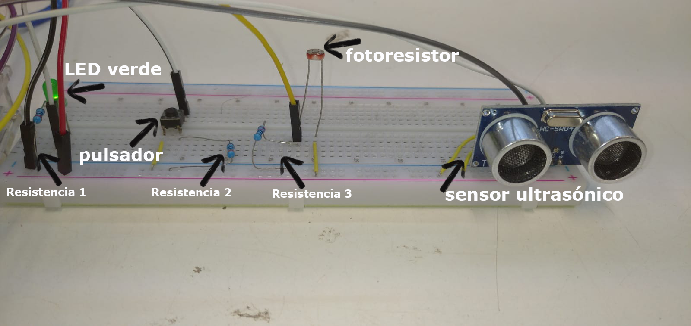

---
hide:
    - toc
---

# MT04

En este módulo hice un sistema controlado por una placa Arduino UNO, que consta de 2 sensores (un fotoresistor y un sensor ultrasónico de movimiento SRF05), un pulsador y dos actuadores: un led y un servomotor. 

El diseño es tal que: el led muestra un brillo dimerizable mediante PWM en forma proporcional a la intensidad de la luz captada por el fotoresitor. Por su parte, la proximidad de un objeto detectada por el sensor de distancia es indicada por un indicador impulsado por el servomotor. En cuanto al pulsador, cuando éste es pulsado el LED parpadea 3 veces (medio segundo en cada encendido y apagado) y retorna al valor de intensidad que tenia previamente a que fuera oprimido el pulsador. 

En el puerto serial pueden leerse los valores de distancia medida por el sensor ultrasónico. la intensidad de luz captada por el fotoresistor y la intensidad relativa de la luz emitida por el LED. 

En primer lugar el sistema se armó y programó de manera virtual usando la web de [Tinkercad](https://www.tinkercad.com/). Cabe destacar que en Tinker actualmente no está disponible el sensor de movimiento HC-SR05, indicado en el enunciado del ejercicio, sino que está disponible uno muy similar el HC-SR04. Éste tiene unos centímetros menos de alcance y carece de un pin de alerta configurable para cuando el objeto supera cierto límite. Son dos sensores muy similares, ambos pueden operarse con 4 pines, y además coincide con el modelo de este tipo de sensor que disponia para hacer el ensamblado del sistema. 

Los componentes fueron siendo agregados paulatinamente y generandosé así versiones cada vez más complejas del script. Para depurar la programación se incluyeron salidas de las variable hacia el puerto serial. Para la codificación del programa se contó con la asistencia de las aplicaciones web de los modelos grandes de lenguaje [ChatGPT4o](https://chatgpt.com/) y [Claude 3.5 Sonnet](https://claude.ai/). Trás probarlo en el simulador de [Tinkercad](https://www.tinkercad.com/) y una vez que el sistema se comportó de la manera deseada, antes descripta, se procedió a su ensamblado físico. 

El esquema de conexiones del sistem armado se muestra en la figura 1. Mientras que información leída a través del puerto serial se muestra en la figura 2. 

**Figura 1**, esquema de conexiones del sistema simulado en la web de Tinkercad. 

 
 

**Figura 2**, salida obtenida en tiempo real a través del puerto serial. Simulación hecha en la web de Tinkercad. 

El sistema físico armado se muestra en las figuras 3 y 4, y un video mostrando su funcionamiento puede [**descargarse desde aquí**](https://drive.google.com/file/d/1NUTHo3zRko7nBVR2gRbXUTaZLLzp3Z_l/view?usp=sharing). 

**Figura 3**, imágen del sistema físicamente ensamblado. 

**Figura 4**, Detalle de los componentes conectados al protoboard. 

El archivo conteniendo el script generado puede  [**descargarse desde aquí**](../archivos/MT04/script_actividad_mt04_v1/script_actividad_mt04_v1.zip). 

