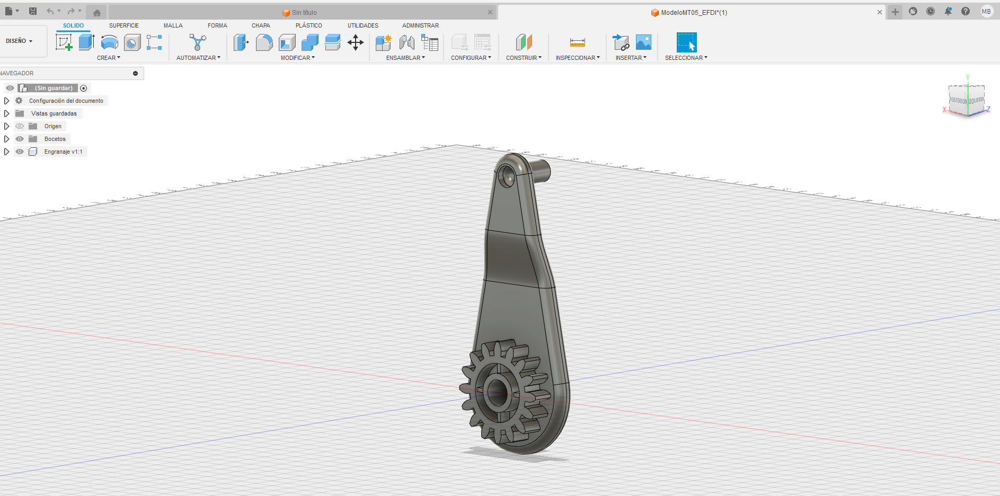
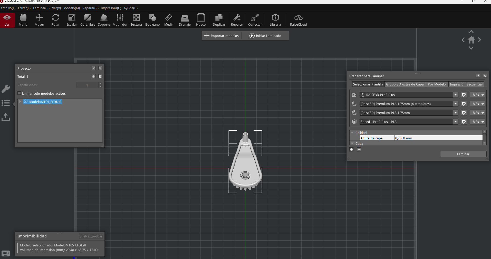
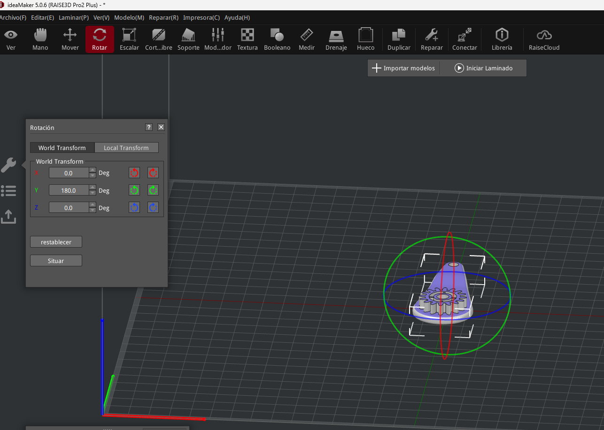
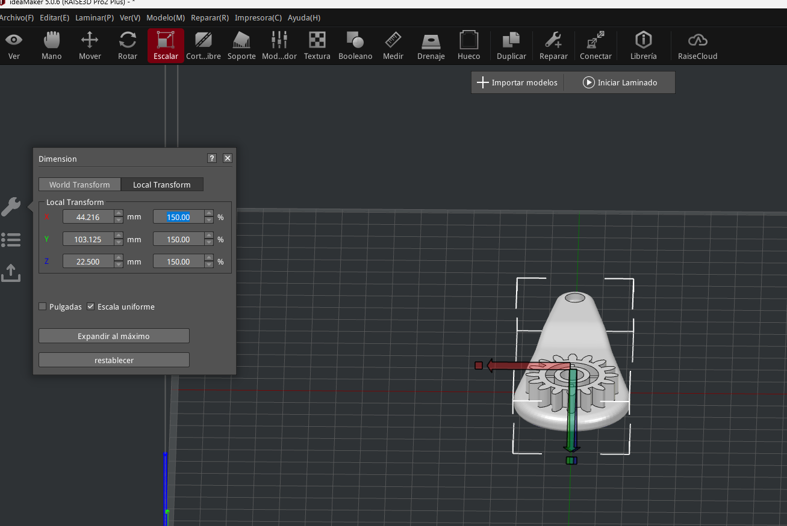
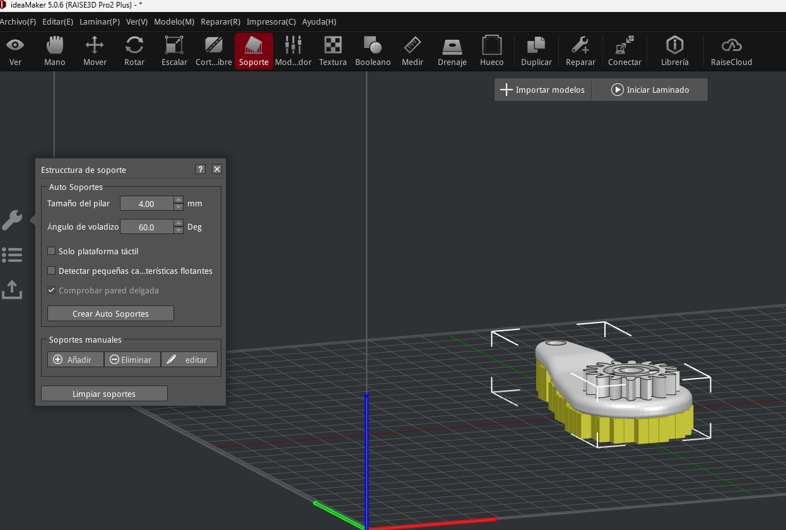
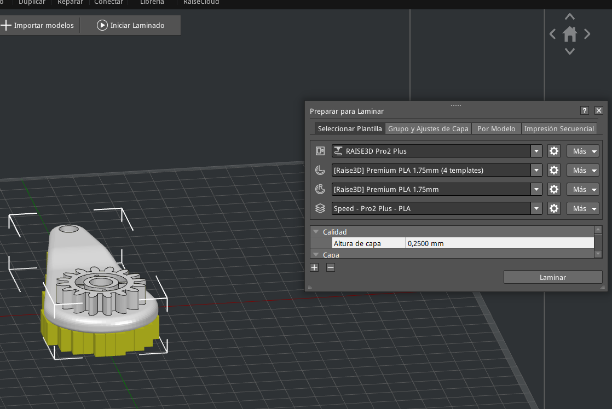
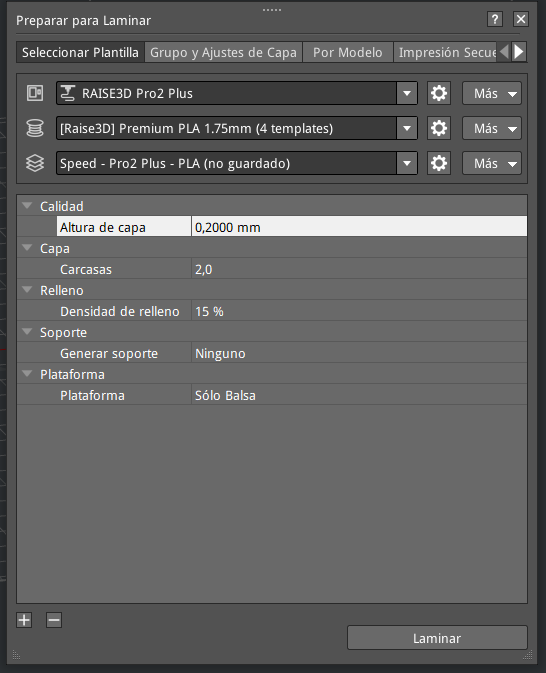
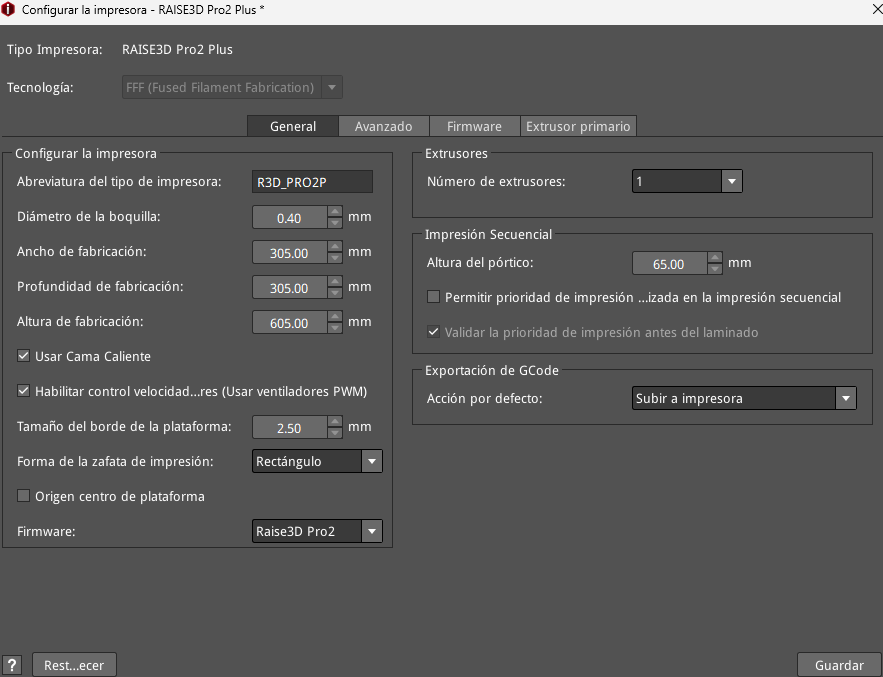
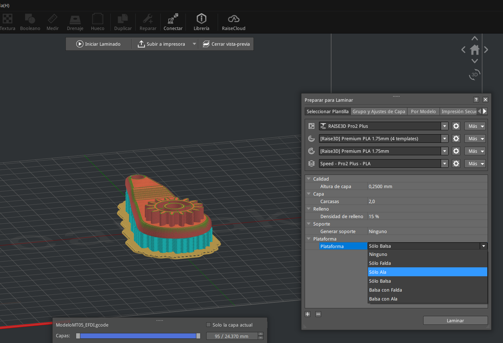
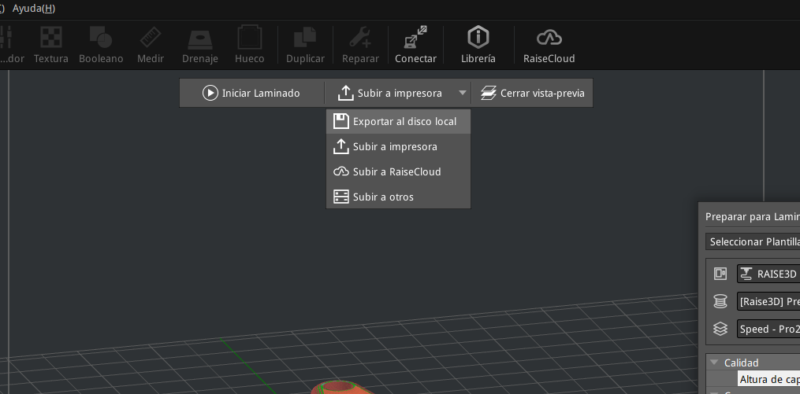

---
hide:
    - toc
---

# MT05
Descargué el archivo desde [este enlace](https://drive.google.com/file/d/1LtPr0RQdWEIW7CtqzE95KyDzig9P1hRA/view?usp=sharing). 

Luego lo abrí con Fusion360 (figura 1) y lo exporté en formato .stl

**Figura 1**, modelo descargado de la pieza siendo visualizado en el programa Fusion 360.

Este archivo .stl luego lo abrí en el software 3D-Ideamaker (figura 2). 

**Figura 2**, archivo .stl de la pieza visualizado en el programa 3D-Ideamaker. 

Roté la pieza de tal forma de facilitar la remoción de los soportes que se generen (figura 3). Aumenté el tamaño de la pieza escalándola de manera uniforme al 150% de su tamaño original (figura 4). 

**Figura 3**, modelo rotado 180 grados para ubicarlo de la manera más conveniente sobre la superficie deimpresion. 

**Figura 4**, modelo escalado al 150% de su tamaño original. 

Apliqué la generación automática de soportes (figura 5). 

**Figura 5**, modelo de la pieza una vez ya han sido generados los soportes de impresión, estos se destacan en color amarillo. 

Luego verifiqué que la impresora seleccionada sea la RAISE3D Pro2 Plus, que es la que tendré disponible en UTEC (figura 6) y que en la sección “plataforma” estuviera seleccionada la opción “Sólo Balsa” (figura 7) allí también configure la altura de capa en 0,2000 mm y el número de perímetros de pared (carcasas) igual a 2. 

**Figura 6**, selección del perfil de impresora a usar para imprimir la pieza. 

**Figura 7**, modificación del perfil de impresión de acuerdo a las indicaciones prestablecidas ene l enunciado de la actividad. 

En la configuración de la impresora elegí que se trabaja solo con un extrusor, el primario (figura 8). 

**Figura 8**, elección del extrusor primario para hacer la impresión. 

Luego de estas establecidas estas configuraciones ejecuté el comando “laminar”. La previsualización de la pieza trás ejecutar el laminado se muestra en la figura 9. 

**Figura 9**, previsualización del modelo laminado de la pieza. 

Para finalizar, exporté archivo de laminado en formato g-code al disco duro local, ver figura 10. 

**Figura 10**, ubicación del comando de exportación del archivo con el código G para imprimir la pieza. 

El archivo con el código G para imprimir la pieza puede descargarse [desde aquí](https://drive.google.com/file/d/1keaOlSJNgvJOos6DQhXKAgcdmD_krMKg/view?usp=sharing).

Consideración final: En esta actividad se pudo procesar un modelo 3D para obtener el código G que permita su impresión en una de las impresoras de UTEC. Generalmente uso al programa Ultimaker CURA como programa slicer, pero en esta oportunidad pude aprender a usar el programa 3D-Ultimaker. 