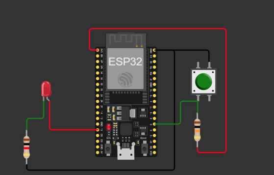
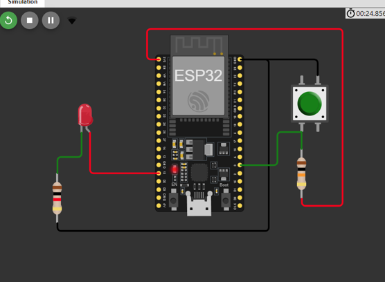
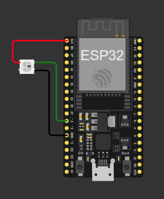
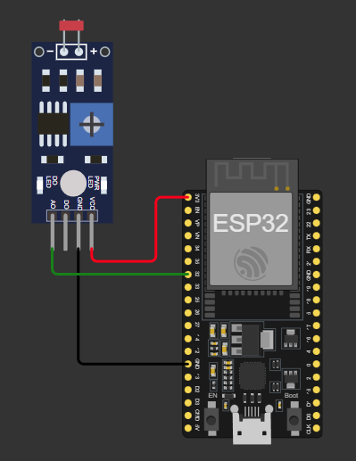

---
hide:
    - toc
---

# MT06
En este modulo, denominado "networking" se trabajó sobre aspectos de conectividad. En esta sección presentó los 4 ejemplos que el docente mostró en clase, y dos implementaciones que luego hice: una del ejemplo 2, pero simulando la interacción entre dos placas a través de un servidor MQTT. Y en el otro caso, hice una segunda implementación a modo de entrega final de este módulo. 

**Ejercicio 1**

**Figura 1**, ensamblado usado en el ejercicio 1.  

Este script está diseñado para trabajar con el circuito mostrado en la imagen, que incluye un microcontrolador ESP32, un LED y un botón. Aquí te explico lo que hace el script:

1. Configuración inicial:
   - Inicia la comunicación serial a 115200 baudios.
   - Configura el pin 13 (LED) como salida.
   - Configura el pin 0 (BUT) como entrada para el botón.

2. Contador de pulsaciones del botón:
   - El script cuenta las pulsaciones del botón y envía el conteo por serial.
   - Utiliza un mecanismo de debounce para evitar múltiples conteos por una sola pulsación.
   - Cuando se presiona el botón (el pin BUT lee LOW), incrementa el contador 'i' y lo imprime.

3. Control del LED vía Serial:
   - El script escucha la entrada serial.
   - Si recibe "on", enciende el LED (HIGH).
   - Si recibe "off", apaga el LED (LOW).

4. Comunicación Serial:
   - Lee los datos seriales entrantes carácter por carácter.
   - Construye una cadena de mensaje hasta que recibe un salto de línea o retorno de carro.
   - Una vez que se recibe un mensaje completo, procesa el comando (on/off) y limpia el buffer del mensaje.

En relación con la imagen del circuito:
- El cable verde conecta el botón al pin 0 (BUT) del ESP32.
- El cable rojo conecta el LED al pin 13 (LED) del ESP32.
- El script permite controlar el LED y leer las pulsaciones del botón, demostrando operaciones básicas de entrada/salida y comunicación serial con el ESP32.

Aclaración sobre el proceso de debounce implementado para el pulsador:
El "debounce" (anti-rebote en español) es una técnica utilizada para evitar lecturas múltiples e incorrectas cuando se presiona un botón físico. Esto es necesario porque los botones mecánicos tienden a "rebotar" cuando se presionan, lo que puede causar múltiples señales en un corto período de tiempo.
En este script, el mecanismo de debounce se implementa de la siguiente manera:

Se utiliza una variable booleana llamada pressed para rastrear el estado del botón.
En el bucle principal (loop()), se verifica la condición del botón:
if(!digitalRead(BUT) && !pressed){
  pressed = true;
  i = i + 1;
  Serial.println(i);
}
else if(digitalRead(BUT)){
  pressed = false;
}

Cuando el botón se presiona (digitalRead(BUT) es falso, lo que significa LOW), el código verifica si pressed es falso. Esto asegura que solo se cuente una vez por pulsación.
Si el botón está presionado y pressed es falso, se establece pressed a verdadero, se incrementa el contador i, y se imprime el valor.
Cuando se suelta el botón (digitalRead(BUT) es verdadero, lo que significa HIGH), se restablece pressed a falso, preparando el sistema para la siguiente pulsación.
El delay(100) al final del bucle también ayuda a reducir los rebotes, dando tiempo para que el botón se estabilice entre lecturas.

Este método de debounce evita que se cuenten múltiples pulsaciones cuando el botón rebota físicamente durante una sola pulsación. Sin esta técnica, una sola pulsación podría registrarse como varias, lo que llevaría a un conteo incorrecto.

**Ejercicio 2**

**Figura 2**, ensamblado usado en el ejercicio 2.  

Este segundo script es más avanzado y utiliza comunicación WiFi y MQTT para controlar el LED y el botón. Voy a explicarlo y luego compararlo con el primer script:

Explicación del segundo script:

1. Configuración inicial:
   - Incluye bibliotecas para WiFi y MQTT (PubSubClient).
   - Define constantes para la conexión WiFi y MQTT.
   - Configura el LED y el botón.

2. Función setup():
   - Inicia la comunicación serial.
   - Configura los pines del LED y botón.
   - Conecta a la red WiFi.
   - Configura el cliente MQTT.

3. Función loop():
   - Mantiene la conexión MQTT.
   - Verifica el estado del botón y publica mensajes MQTT cuando se presiona.

4. Funciones adicionales:
   - mqttConnect(): Maneja la conexión al broker MQTT.
   - callback(): Procesa los mensajes MQTT recibidos.
   - publishMessage(): Publica mensajes MQTT.

Comparación con el primer script:

1. Conectividad:
   - Primer script: Solo usa comunicación serial local.
   - Segundo script: Utiliza WiFi y MQTT para comunicación remota.

2. Control del LED:
   - Primer script: Control local mediante comandos seriales.
   - Segundo script: Control remoto a través de mensajes MQTT.

3. Funcionalidad del botón:
   - Primer script: Cuenta y reporta pulsaciones localmente.
   - Segundo script: Envía mensajes MQTT para controlar un LED remoto.

4. Complejidad:
   - Primer script: Más simple, enfocado en interacciones locales.
   - Segundo script: Más complejo, permite interacciones y control remotos.

5. Escalabilidad:
   - Primer script: Limitado a la conexión serial.
   - Segundo script: Puede interactuar con múltiples dispositivos a través de MQTT.

6. Aplicación:
   - Primer script: Ideal para proyectos simples y autónomos.
   - Segundo script: Adecuado para proyectos de IoT y sistemas distribuidos.

En resumen, mientras que el primer script se centra en la interacción local con el ESP32, el segundo script expande significativamente las capacidades al integrar conectividad WiFi y MQTT, permitiendo control y monitoreo remotos, lo que lo hace más adecuado para aplicaciones de Internet de las Cosas (IoT).

**Ejercicio 3**

**Figura 3**, ensamblado usado en el ejercicio 3.

Este tercer script está diseñado para trabajar con el circuito que incluye un ESP32 y un LED NeoPixel. Aquí está el análisis del script:

1. Librerías y configuración:
   - Utiliza WiFi, PubSubClient (para MQTT) y Adafruit_NeoPixel.
   - Configura la conexión WiFi y MQTT similar al segundo script.
   - Define un NeoPixel en el pin 14.

2. Función setup():
   - Inicia la comunicación serial y el NeoPixel.
   - Conecta a WiFi y configura el cliente MQTT.

3. Función loop():
   - Mantiene la conexión MQTT.
   - Lee entrada serial para controlar el color del NeoPixel y publicar mensajes MQTT.

4. Funcionalidad principal:
   - Permite cambiar el color del NeoPixel mediante comandos seriales.
   - Publica el color elegido a un topic MQTT específico.
   - Recibe mensajes MQTT para cambiar el color del NeoPixel.

5. Funciones adicionales:
   - mqttConnect(): Maneja la conexión al broker MQTT.
   - callback(): Procesa los mensajes MQTT recibidos y actualiza el color del NeoPixel.
   - publishMessage(): Publica mensajes MQTT.

Comparación con los scripts anteriores:

1. Hardware:
   - Este script utiliza un NeoPixel en lugar de un LED simple, permitiendo control de color.

2. Conectividad:
   - Al igual que el segundo script, utiliza WiFi y MQTT para comunicación remota.

3. Funcionalidad:
   - Permite control bidireccional: puede cambiar el color localmente y publicarlo, o recibir instrucciones de color remotamente.

4. Complejidad:
   - Es más complejo que los anteriores debido al manejo del NeoPixel y la integración de entrada serial con MQTT.

5. Interactividad:
   - Ofrece mayor interactividad al permitir control de color específico.

6. Aplicación:
   - Ideal para proyectos IoT que requieren control de iluminación más avanzado.

En resumen, este tercer script expande las capacidades de los anteriores al integrar un LED NeoPixel controlable por color, manteniendo la funcionalidad de comunicación remota vía MQTT. 

**Ejercicio 4**

**Figura 4**, ensamblado usado en el ejercicio 4.

Este cuarto script está diseñado para trabajar con el circuito que muestra un ESP32 conectado a un sensor analógico (probablemente un potenciómetro) en el pin 32. Aquí está el análisis del script:

1. Configuración y librerías:
   - Utiliza WiFi y PubSubClient para MQTT, similar a los scripts anteriores.
   - Configura la conexión WiFi y MQTT.

2. Función setup():
   - Inicia la comunicación serial.
   - Configura el pin 32 como entrada (para el sensor analógico).
   - Conecta a WiFi y configura el cliente MQTT.

3. Función loop():
   - Mantiene la conexión MQTT.
   - Lee el valor del sensor analógico cada segundo y lo publica via MQTT.

4. Funcionalidad principal:
   - Lee periódicamente (cada segundo) el valor analógico del pin 32.
   - Publica este valor junto con un mensaje a través de MQTT.

5. Funciones adicionales:
   - mqttConnect(): Maneja la conexión al broker MQTT.
   - callback(): Está definida pero no se utiliza activamente en este script.

Comparación con los scripts anteriores:

1. Hardware:
   - Este script utiliza un sensor analógico en lugar de un LED o NeoPixel.

2. Conectividad:
   - Al igual que el segundo y tercer script, utiliza WiFi y MQTT para comunicación remota.

3. Funcionalidad:
   - Se centra en la lectura y publicación de datos del sensor, en lugar de controlar un actuador.

4. Periodicidad:
   - Implementa una publicación periódica (cada segundo) de datos, a diferencia de los scripts anteriores que respondían a eventos específicos.

5. Dirección de datos:
   - Principalmente envía datos (del sensor al broker MQTT), mientras que los scripts anteriores tenían una comunicación más bidireccional.

6. Aplicación:
   - Ideal para proyectos IoT de monitoreo, donde se necesita recopilar y enviar datos de sensores regularmente.

En resumen, este cuarto script se enfoca en la recolección y transmisión de datos de un sensor analógico. Es más simple en términos de interacción local (no hay control de LEDs o botones), pero proporciona una funcionalidad crucial para aplicaciones de IoT que requieren monitoreo continuo de variables físicas. Este tipo de script sería útil en proyectos como estaciones meteorológicas, sistemas de monitoreo ambiental, o cualquier aplicación donde se necesite recopilar y transmitir datos de sensores regularmente. 

**Implementación de comunicación entre dos placas ESP32, basado en el ejercicio 2**
Basándome en el ejercicio 2, creé dos simuladores de placas ESP32. Para cada una de estas configuré un cliente diferente del servicio MQTT, e intercmabié entre ambas los tópicos de publicación y lectura, de tal modo de establecer una vía de comunicación bidireccional entre ambas: al mantener oprimido el pulsador de una placa, se enciende el LED de la otra placa, tal como se aprecia en la figura 5. 

<iframe width="560" height="315" src="https://www.youtube.com/embed/R0yDDWTXmTQ" frameborder="0" allow="autoplay; encrypted-media" allowfullscreen></iframe>

<strong>Figura 5</strong>, funcionamiento de la implementación efectuada para simular la comunicación entre dos placas ESP32.

**Entrega final del módulo**
Hice una simulación doble en Wokwi, simulando a dos placas coordinadas a través de un servidor MQTT. 

Placa 1. 
Al simulador creado para esta placa puede accederse desde este enlace: https://wokwi.com/projects/409601839235474433  
Respaldé este proyecto de wokwi y puede [**descargarse desde aquí**](../archivos/MT06/marcel1.zip). 
Es una placa ESP32 que tiene conectado un LED verde y un fotoresistor. 

Placa 2. 
Al simulador creado para esta placa puede accederse desde este enlace: https://wokwi.com/projects/409613412113185793
Respaldé este proyecto de wokwi y puede [**descargarse desde aquí**](../archivos/MT06/marcel2motor.zip). 
Es una placa ESP32 que tiene conectados un LED rojo, un servomotor y un pulsador. 

Comportamiento esperado: 
La idea es que a través de la placa 1, el fotorresistor envía el nivel de luz monitoreado, sí éste es bajo entonces ordena que en la placa 2 se encienda el led rojo y el servomotor que tiene conectados. Esto podría representar un mecanismo remoto para correr un cobertizo y encender las luces interiores de un recinto dependiendo del nivel de luz solar que detecte la placa 1 con su resistor expuesto al exterior. 

Para chequear la comunicación entre ambas placas, se puede presionar el pulsador de la placa 2, y esto ocasiona que se encienda el LED verde conectado a la placa 1. 

Se logró simular correctamente el comportamiento esperado, el cual se puede apreciar en la figura 6. 

<iframe width="560" height="315" src="https://www.youtube.com/embed/gRTwzIjqgp8" frameborder="0" allow="autoplay; encrypted-media" allowfullscreen></iframe>

<strong>Figura 6</strong>, video del funcionamiento del sistema creado para la entrega final de este módulo. 

