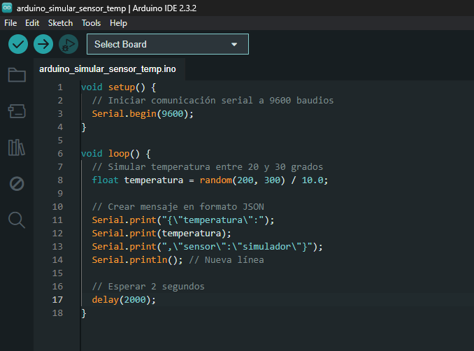
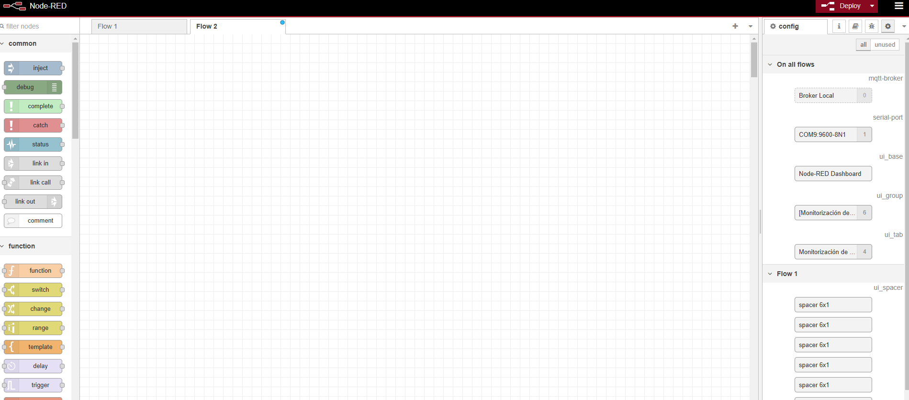
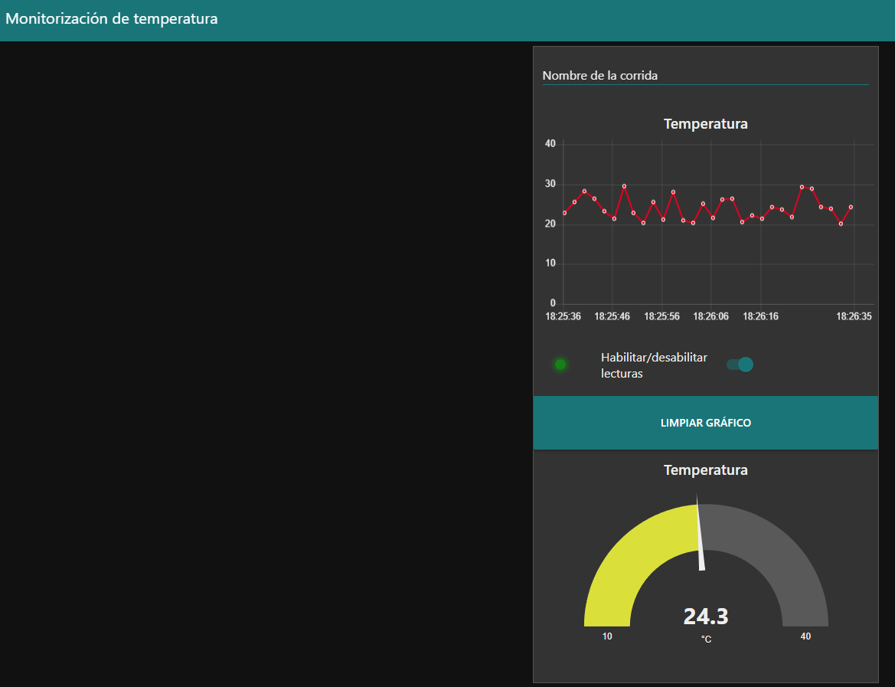
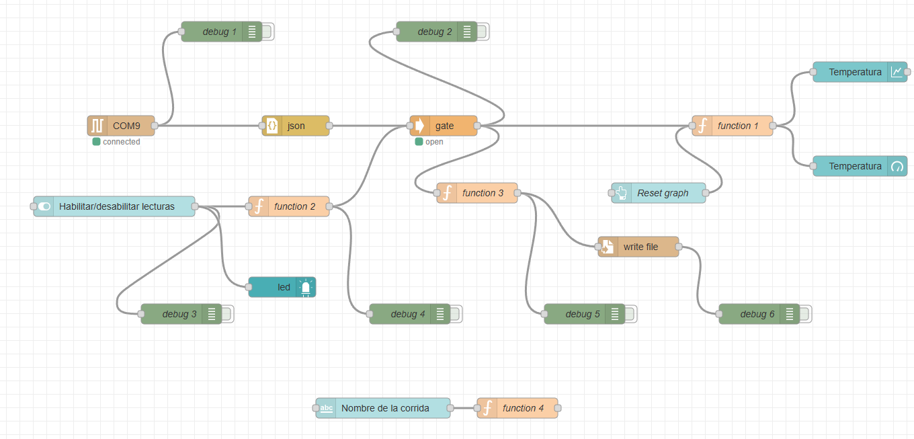

---
hide:
    - toc
---

# MT07
Para la entrega final de este módulo opté por generar una interfaz gráfica de usuario (GUI) para la monitorización de datos recabados por una placa programable Arduino y leídos por una PC a través de su puerto serial. Como prueba de concepto y para independizarla del sensor empleado, generé un [**script**](../archivos/MT07/arduino_simular_sensor_temp.zip)de Arduino (Figura 1) que simula la medición de temperaturas y las comunicac a través del puerto serial USB (Figura 2). Destaco que con este tipo de simulacion, haciendo correccione relativamente menores, es posible adpatar la interfaz gráfica que ahuí se genera, a sensores de diversa naturaleza. 

Figura 1. IDE de Arduino mostrando el script simulador de medidas de temperatura y comunicación de las mismas a través del puerto serial. 

Figura 2. Información leída a través del puerto serial cuando la placa Arduino progrmada está conectada. 

La interfaz gráfica fue generada con Node-red, para ello primero descargué e instalé Node.js desde su [**web oficial**](https://nodejs.org/en/). Luego instalé Node-red siguiendo [**estas instrucciones**](https://nodered.org/docs/getting-started/windows). La interfaz inicial de node-red se muestra en la figura 3. 

 Figura 3. Interfaz inicial de Node-red. 

En primer lugar se hizo un interfaz simple, usando un nodo de lectura del puerto esserial, luego un nodo json y uno de función para alimentar correctamente a un nodo de gráfico (chart) cartesiano xy. Luego de verificado que los datos comunicados a través del puerto serial logaron ser incluidos en tiempo real en el gráfico, comencé a agregar mayore detalles a la interfaz gráfica. 

Incluí un swith de dashboard para habilitar o deshabilitar la inclusión de las lecturas recibidas a través del puerto serial. Tambien agregué un boton grande para borrar el gráfico y asi dejarlo pronto para recibir nuevos datos. Adedmás del gráfico cartesiano, incluí un gráfico del tipo manómetro o gauge para mostar la última lecutra obtenida, adaptando el espectro de color de este indicador, para que su tono dé una idea más intuitiva del nivel de temperatura medido. Tambien para facilitar la interprestacion de la interfaz, agregué un LED indicado en la misma, el cual cambia de gris a verde, cuando el sistema comienza a regitrar datos de temperatura. Tambien hice algunas modificaciones al tema de la interfaz, para modificar su combinación de colores. 

Para guardar los datos leídos, agregué un nodo "write file" en un flujo tal que cada vez que se reinica manualmente la toma de lecturas, un nuevo archivo de texto con valores separados por comas (.csv) es creado. El nombre de este archivo es formado por un prefijo introducido por el usuario en una entrada de texto, que también incluí en la interfaz, y la fecha y hora de creado el archivo. La interfaz gráfica obtenida se muestra en la figura 4, y el código generado con Node-red se puede  [**descargar desde aquí**]([../archivos/MT07/flows_MBentancor_MT07.zip])
En la figura 5 se muestra éste diagrama de flujo de Node-red. 

 Figura 4. Interfaz gráfica obtenida. Se incluye varios módulos debug que sirvieron para ir optimzándola mientras la generaba. 

 Figura 4. Diagrama de flujo de Node-red creo para generar la interfaz gráfica de usuario. 

Referencias sugeridas
Para aprender Node-red me resultó útil [**este curso**](https://www.youtube.com/watch?v=20RvO080yQ0&list=PLcmn4IteQPYqcZuzR7VLkQsFeAN0fPsPN). 

