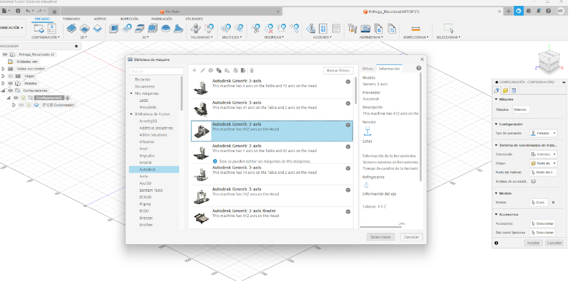

---
hide:
    - toc
---
+++++++++++++++++++++++++++++++
# MT08

Desde el programa Fusion360 abro el archivo del modelo descargado desde el enlace proporcionado en [el enlace](https://drive.google.com/file/d/1ZYWWS8ZjT-IKuC65fll52j4DFn_RKEVR/view?usp=sharing) del enunciado del ejercicio (Figura 1). 

**Figura 1**. Visualización del modelo 3D contenido en el archivo inicial descargado. 

En el menú de opciones (ubicado a la izquierda de la pantalla, figura 1b) hago clic derecho sobre Configuración y en la opción “Editar” que se despliega. En el cuadro de diálogo que se abre selecciono la máquina a usar, la misma se cargó luego de unos segundos de descarga y ajustes automáticos.

**Figura 1b**. Opción para configurar propiedades generales del trabajo. 

En ese cuadro de diálogo también selecciono el punto de origen  (Origen > Punto de bloque de material > Punto de material > Punto del cuadro) en uno de los vértices de la plancha de material (en mi caso selecciono al vértice superior izquierd, fiugra 1c). 

**Figura 1c**. Selección del punto de origen del sistema de coordenadas. 

Luego selecciono la orientación adecuada de los ejes del sistema de coordenadas: Orientación > Ejes X e Y. Luego elijo la dirección de los ejes X e Y eligiendo una arista paralela al que se desea configurar. El sentido deseado de cada eje puede requerir activar la opción de “Invertir el eje” (figura 1d). 

**Figura 1d**. Detalle de la selección de dirección y sentido del sistema de coordenadas.

En la pestaña de material, selecciono: Modo > Bloque de material fijo, y verifico que las medidas configuradas sean: Anchura 200mm, Altura  200mm, Profundidad 10mm (figura 1e). 

**Figura 1e**. Configuración del material a usar.

Luego de guardar el documento continué con el mismo abierto en Fusion 360 y allí configuré la máquina indicada por el enunciado del ejercicio, eligiendola desde el menú de la izquierda “Configuración” y luego eligiendo: Máquina  > Seleccionar (Figura 2). 

**Figura 2**. Elección de la máquina a emplear.  

Elijo la fresa indicada por el ejercicio, haciendo clic en administrar > herramientas (Figura 3). 

**Figura 3**. Selección de la fresa adecuada. 

Sobre el menú ubicado a la izquierda voy a Configuraciones >> Orientación de la herramienta, y ahi puedo confirmar que el origen del mecanizado está ubicado en la posición que indica el enunciado de la actividad (Figura 4). 

**Figura 4**. Ubicación del origen de coordenadas para la fase de mecanizado. 

Luego paso a hacer los diferentes proceso de mecanizado, en cada uno debo configurar: 
1- El tipo de mecanizado, por ejemplo: 2D cajeras, taladro o contorno. 
2- Tipo de herramienta
3- Geometría (consiste en especificar la trayectoria de la herramienta)
4- Alturas (Para evitar colisiones de la herramienta con el material al trasladarse ésta)
5- Se configuran las pasadas, indicando la profundidad de cada éstas. 
6- Se configuran las conexiones finales que se dejan en la pieza antes de liberarla. 

Para el diseño central cruciforme, elijo una operación de 2D cajeras > Contorneados de la cara > Selecciono el diseño cruciforme central (figura 5). 

**Figura 5**. Mecanizado del diseño cruciforme central. 

Luego verifico las alturas (figura 6) y simulo la operación (figura 7). 

**Figura 6**. Verificación de las alturas de operación. 

**Figura 7**. Simulación de la operación de 2D cajeras usada para el motivo central de la pieza. 

Luego hago las 4 perforaciones, con “Taladrado”, y verifico las alturas (figura 7) y simulo la operación (figura 8). 

**Figura 8**. Verificación de alturas para la operación de taladrado. 

**Figura 9**. Simulación de la operación de taladrado. 

Luego programo el mecanizado de las depresiones alrededor de cada perforación, haciendo: 2D cajeras (figuras 10 y 11). 

**Figura 10**. Verificación de la operación de 2D cajeras alrededor las posiciones taladradas. 

**Figura 11**. Simulación de la operación de 2D cajeras alrededor las posiciones taladradas. 

Se elije el recorte del contorno externo de la pieza haciendo la operación: 2D contorneado > Cadena cerrada, y activo la casilla “Apoyos” para crear las conexiones que finalmente romperé para liberar la pieza del resto del material. 

**Figura 12**. Configuración de la operación de 2D contorneado a lo largo del perímetro del modelo. 

Verifico las alturas en el modelo (figura 13). 

**Figura 13**. Verificación de la operación de 2D contorneado a lo largo del perímetro del modelo. 

En la pestaña “Pasadas” indico 1mm como valor de “Reducción de desbaste máxima” tal como indica el enunciado del ejercicio. 

**Figura 14**. Configuración del valor máximo de reduccion de desbaste.  

La trayectoria de esta operación de corte se muestra en la figura 15. 

**Figura 15**. Simulación de la operación de recorte alrededor del perimetro externo del modelo.  

Para diminuir el uso de la fresa en sectores, como circulo central de esta pieza, que no forman parte de la pieza final, reordeno las operaciones de mecanizado, haciendo en primer lugar el recorte del circulo central. Luego Reconfiguré la operaicón 2D cajeras sobre el diseño cruciforme central. 

La simulación final de las operaciones de mecanizado del modelo se pueden ver [aquí](https://youtu.be/9Y1AKB5WX7M?si=6lvxdMDo4mFyLKeB). 

Una vista general del final de mecanización simulada se muestra en la figura 16. 

**Figura 16**. Vista general del final de la simulacion de la mecanización del modelo.  

Luego hice el postprocesamiento del modelo mecanizado para generar el archivo de gcode que puede [**descargarse desde aquí**](../archivos/MT08/Marcel_Bentancor_mt08a.nc). 