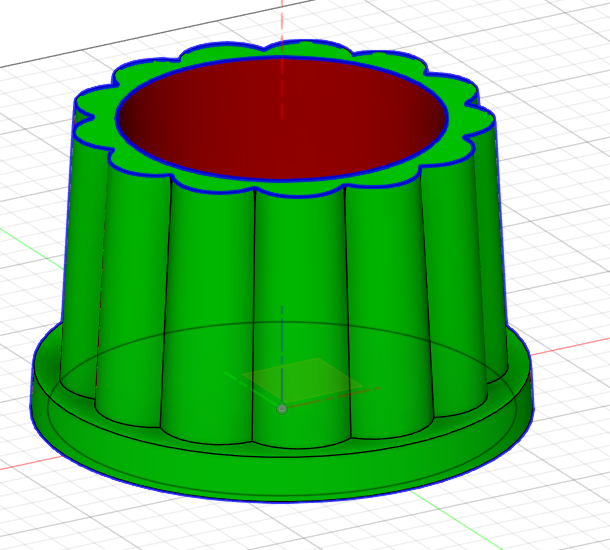

---
hide:
    - toc
---

# MT09
En este modulo, denominado "moldes" se trabajó sobre los fundamentos para la elaboración de piezas a través del uso de moldes. 
Aquí se describe el proceso de elaboracion de la entrega final de este módulo: diseñando un molde para la fabricación de una maceta. 
El diseño y fabricación de moldes para objetos tridimensionales, como macetas, es una aplicación muy importante en ingeniería y manufactura, que combina conceptos de diseño asistido por computadora (CAD) y fabricación aditiva. Los moldes permiten reproducir piezas con precisión mediante técnicas como el vaciado de materiales en estado líquido o semilíquido, siendo clave considerar aspectos como la geometría del diseño, la facilidad de desmoldeo y la resistencia del material del molde. En este proyecto, se emplea el software Fusion 360 para modelar tanto la maceta como su molde, abordando retos prácticos de diseño, optimización y producción mediante impresión 3D, con el fin de lograr funcionalidad y viabilidad en el proceso.

En  la figura 1 se muestra el diseño básico de la maceta. 

**Figura 1**, vista general de los primeros pasos del diseño de la maceta.  

Luego se decoró la maceta con un relive, a partir del diseño hecho en el plano superior y luego extruyendo en modo remoción sobre el lateral de la maceta. 

**Figura 2**, elaboración del decorado lateral de la maceta.

En la figura 3 se aprecia que la maceta tiene varias segmentos de paredes verticales, los cuales obstaculizarían el desmoldado de la pieza. Por lo tanto se genera un ángulo de desmolde sobre las paredes exteriores para facilitar la separacion del molde, se eligió un ángulo de desmoldado de 3 grados. 

**Figura 3**, generación de ángulos de desmoldado sobre las paredes laterales verticales de la maceta.

Luego se hizo el análisis de desmoldado provisto por Fusion360 y se detectó que a la pared interna también debe agregarsele un ángulo de desmoldado, aqui tambien se consideró que la el sentido de desmoldado sería hacia arriba de la parte superior de la maceta. Se hizo un nuevo análisis del desmoldado, el cual se muestra en la figura 5. 

**Figura 4**, análisis inicial de desmoldado de la maceta.

**Figura 5**, análisis de desmoldado de la maceta, luego de incluir un ángulo de desmoldado en la pared interna de la maceta.

Luego para diseñar el molde, hice un prisma alrededor de la maceta, apartir del plano inferior de la misma (figura 6). 

**Figura 6**, extrusión inicial para generar el prisma básico del molde.

Usando el plano inferior de la maceta se hizo la división del prisma, gernadose asi dos componentes, denominándolos: molde_sup y molde_inf (figura 7). 

**Figura 7**, división del prisma usado para hacer el molde.

Luego con una operacion de combiando en modalidad corte, resté la pieza "maceta" a la pieza "molde_sup", lo cual ahuecó a éste último (figura 8). 

**Figura 8**, vista en perspectiva de la pieza molde_sup ya ahuecado con la pieza "maceta". 

En la pieza "molde_inf" se generaron dos perforaciones (figura 9): una para usar como vertedero del material fundido y otra como respiradero para poder evacuar el aíre desplazado durante el vertido del material fundido. 

**Figura 9**, vista de la perforaciones hechas como vertedero y respiradero en el molde. 

Para guiar el acople de las piezas molde_sup y molde_inf se agregaron cuatro esferas en modo "unido" al molde_sup, y luego se hizo una combinación en modo "corte" restándole la parte superpuesta del molde_sup sobre el molde_inf (figura 11)

**Figura 10**, agregado de hemisferios esféricos a modo de guía sobre el molde_sup. 

**Figura 11**, encastres hechos para guiar la unión entre el molde_sup y el molde_inf. 

En la figura 12 se muestra la vista general exterior del molde y una vista en coste transversal a nive las perforaciones del vertedero y respiradero. 

**Figura 12**, vista general y corte transversal del molde. 

El archivo .f3d compactado de la maceta y el molde puede  [**descargarse desde aquí**](../archivos/MT09/mt09_final v1_MarcelB.zip). 

